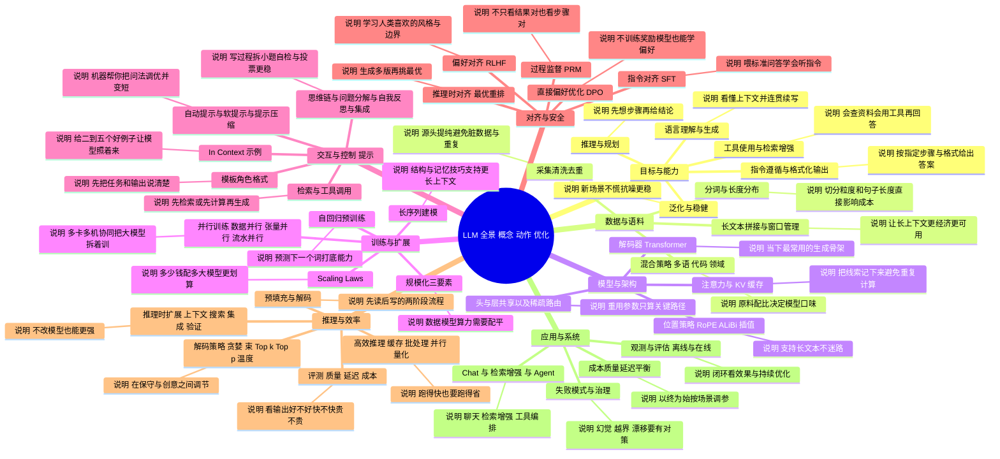
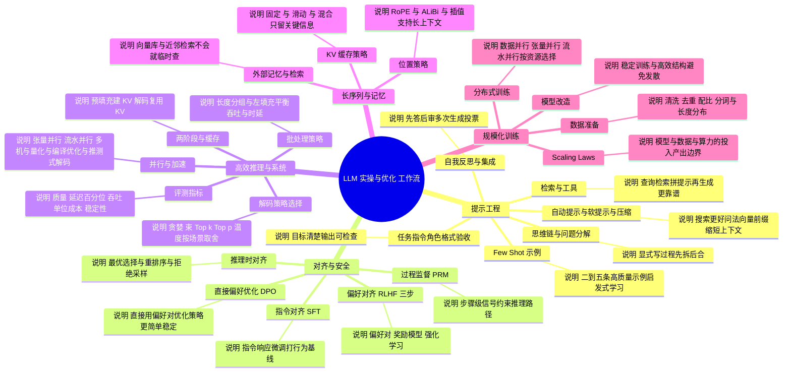
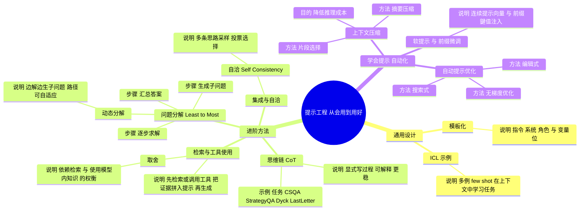
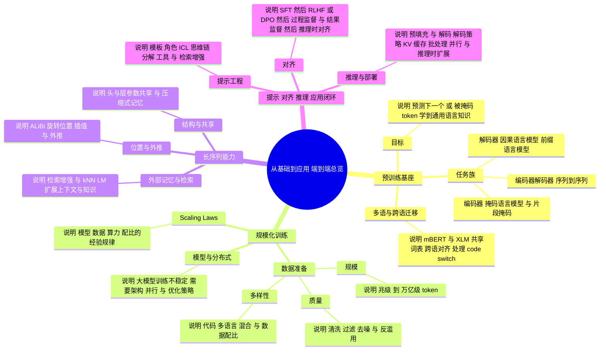

```mermaid
mindmap
  root((LLM 全景 概念 动作 优化))
    目标与能力
      语言理解与生成
        说明 看懂上下文并连贯续写
      指令遵循与格式化输出
        说明 按指定步骤与格式给出答案
      推理与规划
        说明 先想步骤再给结论
      工具使用与检索增强
        说明 会查资料会用工具再回答
      泛化与稳健
        说明 新场景不慌抗噪更稳
    数据与语料
      采集清洗去重
        说明 源头提纯避免脏数据与重复
      混合策略 多语 代码 领域
        说明 原料配比决定模型口味
      分词与长度分布
        说明 切分粒度和句子长度直接影响成本
      长文本拼接与窗口管理
        说明 让长上下文更经济更可用
    模型与架构
      解码器 Transformer
        说明 当下最常用的生成骨架
      注意力与 KV 缓存
        说明 把线索记下来避免重复计算
      头与层共享以及稀疏路由
        说明 重用参数只算关键路径
      位置策略 RoPE ALiBi 插值
        说明 支持长文本不迷路
    训练与扩展
      自回归预训练
        说明 预测下一个词打底能力
      规模化三要素
        说明 数据模型算力需要配平
      并行训练 数据并行 张量并行 流水并行
        说明 多卡多机协同把大模型拆着训
      Scaling Laws
        说明 多少钱配多大模型更划算
      长序列建模
        说明 结构与记忆技巧支持更长上下文
    交互与控制 提示
      模板角色格式
        说明 先把任务和输出说清楚
      In Context 示例
        说明 给二到五个好例子让模型照着来
      思维链与问题分解与自我反思与集成
        说明 写过程拆小题自检与投票更稳
      检索与工具调用
        说明 先检索或先计算再生成
      自动提示与软提示与提示压缩
        说明 机器帮你把问法调优并变短
    对齐与安全
      指令对齐 SFT
        说明 喂标准问答学会听指令
      偏好对齐 RLHF
        说明 学习人类喜欢的风格与边界
      直接偏好优化 DPO
        说明 不训练奖励模型也能学偏好
      过程监督 PRM
        说明 不只看结果对也看步骤对
      推理时对齐 最优重排
        说明 生成多版再挑最优
    推理与效率
      预填充与解码
        说明 先读后写的两阶段流程
      解码策略 贪婪 束 Top k Top p 温度
        说明 在保守与创意之间调节
      高效推理 缓存 批处理 并行 量化
        说明 跑得快也要跑得省
      推理时扩展 上下文 搜索 集成 验证
        说明 不改模型也能更强
      评测 质量 延迟 成本
        说明 看输出好不好快不快贵不贵
    应用与系统
      Chat 与 检索增强 与 Agent
        说明 聊天 检索增强 工具编排
      观测与评估 离线与在线
        说明 闭环看效果与持续优化
      失败模式与治理
        说明 幻觉 越界 漂移要有对策
      成本质量延迟平衡
        说明 以终为始按场景调参
```

```mermaid
mindmap
  root((LLM 实操与优化 工作流))
    提示工程
      任务指令角色格式验收
        说明 目标清楚输出可检查
      Few Shot 示例
        说明 二到五条高质量示例启发式学习
      思维链与问题分解
        说明 显式写过程先拆后合
      自我反思与集成
        说明 先答后审多次生成投票
      检索与工具
        说明 查询检索拼提示再生成更靠谱
      自动提示与软提示与压缩
        说明 搜索更好问法向量前缀缩短上下文
    对齐与安全
      指令对齐 SFT
        说明 指令响应微调打行为基线
      偏好对齐 RLHF 三步
        说明 偏好对 奖励模型 强化学习
      直接偏好优化 DPO
        说明 直接用偏好对优化策略更简单稳定
      过程监督 PRM
        说明 步骤级信号约束推理路径
      推理时对齐
        说明 最优选择与重排序与拒绝采样
    高效推理与系统
      两阶段与缓存
        说明 预填充建 KV 解码复用 KV
      解码策略选择
        说明 贪婪 束 Top k Top p 温度按场景取舍
      批处理策略
        说明 长度分组与左填充平衡吞吐与时延
      并行与加速
        说明 张量并行 流水并行 多机与量化与编译优化与推测式解码
      评测指标
        说明 质量 延迟百分位 吞吐 单位成本 稳定性
    长序列与记忆
      位置策略
        说明 RoPE 与 ALiBi 与 插值支持长上下文
      KV 缓存策略
        说明 固定 与 滑动 与 混合 只留关键信息
      外部记忆与检索
        说明 向量库与近邻检索不会就临时查
    规模化训练
      数据准备
        说明 清洗 去重 配比 分词与长度分布
      模型改造
        说明 稳定训练与高效结构避免发散
      分布式训练
        说明 数据并行 张量并行 流水并行按资源选择
      Scaling Laws
        说明 模型与数据与算力的投入产出边界
```

```mermaid
mindmap
  root((提示工程 从会用到用好))
    通用设计
      模板化
        说明 指令 系统 角色 与 变量位
      ICL 示例
        说明 多例 few shot 在上下文中学习任务
    进阶方法
      思维链 CoT
        说明 显式写过程 可解释 更稳
        示例 任务 CSQA StrategyQA Dyck LastLetter
      问题分解 Least to Most
        步骤 生成子问题
        步骤 逐步求解
        步骤 汇总答案
        动态分解
          说明 边解边生子问题 路径可自适应
      检索与工具使用
        说明 先检索或调用工具 把证据拼入提示 再生成
        取舍
          说明 依赖检索 与 使用模型内知识 的权衡
      集成与自洽
        自洽 Self Consistency
          说明 多条思路采样 投票选择
    学会提示 自动化
      自动提示优化
        方法 搜索式
        方法 编辑式
        方法 无梯度优化
      软提示 与 前缀微调
        说明 连续提示向量 与 前缀鍵值注入
      上下文压缩
        方法 片段选择
        方法 摘要压缩
        目的 降低推理成本
```

```mermaid
mindmap
  root((从基础到应用 端到端总览))
    预训练基座
      目标
        说明 预测下一个 或 被掩码 token 学到通用语言知识
      任务族
        解码器 因果语言模型 前缀语言模型
        编码器 掩码语言模型 与 片段掩码
        编码器解码器 序列到序列
      多语与跨语迁移
        说明 mBERT 与 XLM 共享词表 跨语对齐 处理 code switch
    规模化训练
      数据准备
        规模
          说明 兆级 到 万亿级 token
        质量
          说明 清洗 过滤 去噪 与 反滥用
        多样性
          说明 代码 多语言 混合 与 数据配比
      模型与分布式
        说明 大模型训练不稳定 需要架构 并行 与 优化策略
      Scaling Laws
        说明 模型 数据 算力 配比的经验规律
    长序列能力
      外部记忆与检索
        说明 检索增强 与 kNN LM 扩展上下文与知识
      位置与外推
        说明 ALiBi 旋转位置 插值 与 外推
      结构与共享
        说明 头与层参数共享 与 压缩式记忆
    提示 对齐 推理 应用闭环
      提示工程
        说明 模板 角色 ICL 思维链 分解 工具 与 检索增强
      对齐
        说明 SFT 然后 RLHF 或 DPO 然后 过程监督 与 结果监督 然后 推理时对齐
      推理与部署
        说明 预填充 与 解码 解码策略 KV 缓存 批处理 并行 与 推理时扩展
```