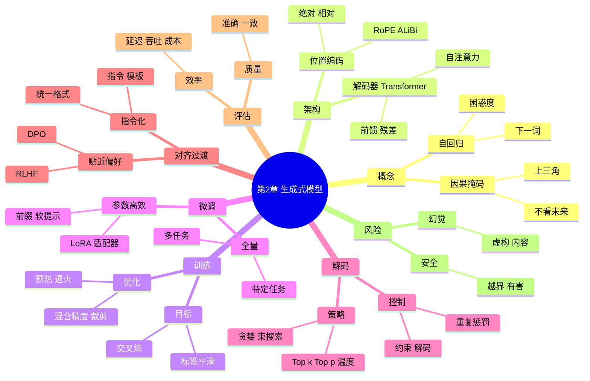

# 第二章 生成式模型

第二章讨论生成式的大型语言模型(LLM)的构建原理和技术细节。这类模型就是我们常说的聊天模型或文本生成 AI，包括 GPT 系列、Anthropic 的 Claude 等。这里我们先介绍 LLM 的基本概念，然后探讨如何训练和微调这些模型，如何对齐模型与人类期望，以及提示的作用。接着，我们会讲述如何通过大规模数据和分布式技术来扩大模型训练，以及解决长文本序列处理的方案。

## 2.1 大语言模型简介

**大型语言模型(LLM)** 通常指参数规模极大（数亿到数千亿）且在海量语料上训练的语言模型。LLM 通常采用仅解码器的 Transformer 架构，擅长根据已给的上下文生成续写文本。由于规模空前且训练语料丰富，LLM 表现出惊人的通用语言能力——不仅能编故事，对答如流，还能执行以前需要专门算法的分析任务（例如代码解释、数学推理等），仿佛拥有“通才智能”。

从概念上，LLM 是基于概率的文本生成器：它为任何给定的文本前缀，定义了下一个词的概率分布 。如果我们用 $Pr(x)$ 表示一段文本$x$的概率，语言模型会将这个概率拆解为每个词逐次出现的条件概率的乘积 。例如，一段话“**今天天气很好**”的概率被分解为：“今”的概率 _ “天”在“今”之后的概率 _ “气”在“今天”之后的概率 _ … _ “好”在“今天天气很”之后的概率。LLM 就是学会去近似这些概率。在实际应用中，我们不直接关心这个概率有多大，而是在让模型**生成**文本时，每一步依据这些概率选取最可能的下一个词，从而产生连贯的输出。

**类比**：可以把 LLM 想象成一个训练有素的**写作机器人**。它脑子里储存了大量词语的接续模式。当你给它开头几句时，它会根据训练中统计到的模式继续往下写。比如，你说“从前有一个国王”，LLM 的大脑中会浮现出无数小说、故事里的相关情节，然后基于概率选一个合适的续写，如“他有三个女儿……”。这个过程没有检索数据库里的现成句子，而更像是**即兴创作**——当然，是遵循统计学上**最可能**的那种创作。

值得注意的是，"大型"主要指参数规模大和训练数据量大，并不只是模型结构复杂。参数越多、见过的语料越丰富，模型越可能学会细致复杂的语言现象，甚至跨越纯统计，表现出某种**推理**和**常识**能力。这在小模型上难以观察，但 LLM 里频繁出现，被称为**涌现能力**：模型规模超过某个阈值后，开始能解决一些它在小规模时完全做不到的任务。这也是为什么近几年大家追求更大规模的模型。

### 2.1.1 仅解码器 Transformer 架构

当前绝大多数 LLM 都采用 Transformer 的**仅解码器**架构。回顾一下，Transformer 解码器是一种堆叠的神经网络层结构，每层包括**自注意力机制**和**前馈网络**。关键在于**自注意力**可以让模型在每个位置"关注"输入序列中更重要的部分。但是**仅解码器**的注意力有一个特殊设置：它是**掩蔽的自注意力**，即每个词只能看见它前面的词，不能看见后面的词。这样确保模型生成下一个词时，只依据之前的信息。在实现上，这通过一个上三角的 Mask 矩阵来完成：遮住当前词之后的位置。

一个标准的仅解码器 Transformer 由几十层这种解码模块堆叠而成。输入通过词嵌入后依次经过层堆栈，输出是每个位置上的表示向量，再经过 softmax 得到下个词概率。因为采用了 Mask，每层的自注意力实际上让模型聚合了**前文**的所有信息来预测下文。层数越深，模型对长距离依赖的建模能力越强。这种结构没有独立的编码器，所有的理解和生成都混合在同一个 Transformer 网络中完成。

**现实模型例子：** GPT-2、GPT-3、GPT-4、Claude、LLaMA 等知名大模型内部都是这种架构。比如 GPT-3 有 96 层 Transformer decoder，每层有多头注意力去看前面的词；Claude 据报道结构类似，也是基于 Transformer decoder。相比编码器-解码器那种“先读后写”的分工，decoder-only 架构更简单直接——**始终在一边读一边写**，每产生一个词就将其纳入上下文再继续生成下一个。

**类比**：仅解码器架构就像人写文章时，一字一句顺序写下去，写当前词的时候只参考已经写好的部分，不去偷看还没写的结局。而编码器-解码器架构更像先打草稿列提纲(编码理解)，再正式写文(解码输出)。大模型大多选择前者，是因为它训练起来相对简单统一，而且生成能力很强。

### 2.1.2 训练 LLM

<mark>训练大型语言模型在本质上与训练一般的语言模型类似：我们有一个海量语料库，目标是**最大化模型对训练语料的概率**，等价于**最小化预测下一个词的误差**。</mark>具体实现中，通常采用**随机梯度下降**(SGD)变种算法来优化模型参数 。

设训练集包含大量序列，每个序列是一段文本 $x = (x_0, x_1, …, x_m)$。LLM 为这个序列定义的概率是各词的条件概率连乘：

$$Pr(x) = \prod_{i=0}^{m} Pr(x_i \mid x_{<i})$$

这里 $x_{<i}$ 表示序列开头到 $i-1$ 的所有词。我们用**对数似然**衡量模型对序列的拟合程度，即 $\log Pr(x)$。训练就是不断调整模型参数 $\theta$，使得训练集所有序列的平均对数似然尽可能大。

因为训练数据极其庞大，我们不会每次用完整语料去算梯度，而是将语料分成许多小**批次(batch)**。每个批次取若干序列，计算模型在这些序列上预测下个词的误差，再反向传播调整参数。随着无数个批次迭代，模型的预测能力不断提高。

**训练 LLM 的挑战**在于规模：一方面数据量大，比如 GPT-3 使用了近 45TB 文本数据，包含上千亿单词；另一方面参数量大，像 GPT-3 有 1750 亿参数。这导致训练一次需要巨大的算力和长时间。例如 GPT-3 训练 reportedly 花费数千个 GPU 日的计算。为了成功训练，优化过程中的**技巧**非常重要，包括选择合适的**学习率调度**（太大会发散，太小训练慢）、**正则化**防止过拟合、以及正确的**初始化**防止梯度消失或爆炸等。后面 2.2 节会详谈工程上的解决方案。

**类比**：训练 LLM 就像**驯养一只庞大的动物**。一开始模型很“野”，输出几乎是乱猜。通过喂给它海量的“书本”和反复纠正（梯度下降调整参数），模型逐渐学会模式。但驯服它很不容易，需要耐心（大量迭代）和技巧（调整超参数）。训练中常见的问题如不稳定，就像动物训练中突然暴躁，需要训练师调整方法（比如降低学习率）来稳定局面。

**小问题：如果训练数据太少会怎样？直觉上，模型可能只“记住”训练集而不能泛化，即出现过拟合**。这有点像只让学生背几道题却希望他举一反三，往往不行。所以 LLM 的成功秘诀之一正是**巨量的数据**，让模型见过足够多样的语言现象，从而学到一般化的能力，而不仅是记忆。

### 2.1.3 微调 LLM

虽然 LLM 在预训练后已经具备处理语言的通用能力，但直接拿一个预训练模型去满足实际应用，往往结果不够理想。**微调**在 LLM 领域依旧扮演着重要角色，只不过微调的目的和方式相对于 BERT 那种针对单一任务的微调有所拓展。

对于 LLM，微调有几个常见场景：

- **指令微调**：这是近年来非常重要的一种微调形式 。它指的是通过有监督学习，让模型更好地遵循人类指令。例如，OpenAI 通过收集大量“指令->响应”的示例，对 GPT-3 进行微调，得到 InstructGPT，使模型学会当用户用指令形式提问时给出有用的回答。这种微调实际上是给模型注入“听话”的能力，让它**对齐人类意图**（这一点我们在 2.1.4 节详细讨论）。
- **对话微调**：类似地，可以用成对的对话数据（用户问句->理想回答）来微调 LLM，使其风格更像聊天助手。例如 Anthropic 公司用大量对话语料微调 Claude，使其擅长长对话、遵守对话礼仪等。对话微调可以被视为指令微调的一个特例，因为开放聊天本质上也是对各种指令的响应，只不过形式是对话式的。
- **领域微调**：将 LLM 在某个专门领域的数据上继续训练，以提升它在该领域的表现。比如有了 GPT-3，我们可以在医学论文和问答数据上微调它，使其更懂医学问题（得到一个医疗助手模型）；或者在法律文档上微调得到法律助手。这其实类似传统模型的微调，只是 LLM 的参数很多，我们通常选择**低学习率、少量 step**来细调，避免毁掉预训练中学到的一般知识。
- **对齐相关微调**：除了指令，对 LLM 进行价值观和安全方面的微调也很重要，比如 OpenAI 会过滤或惩罚模型输出不当内容的倾向。这些通常结合人类反馈进行强化学习微调（见下节），不过也可以预先用一些人工构造的规则数据进行有监督微调，使模型学会拒答敏感请求等。

微调 LLM 通常仍使用梯度下降，只是规模较预训练小很多。因为预训练好的模型已经很强，我们往往需要的数据少、训练轮次也少，这样既**高效**又**经济**。然而，即使是小规模微调，也需要注意选择合适的超参数（学习率、batch 大小等）以防止模型性能下降或发生灾难性遗忘。一些研究也提出了**高效微调**方法，比如只训练部分参数(LoRA 方法)或者多任务微调等，使得针对不同任务快速定制模型成为可能。

**例子：ChatGPT 实际上经历了两阶段微调：先用监督微调(SFT)教会模型遵循人类指令（让模型见识正确的问答范例），再用人类反馈强化学习进一步调整（后面会谈）。这样的微调使得 ChatGPT 相较基底的 GPT-3，更加听从用户、回答有礼有据，也懂得拒绝不当要求**。

### 2.1.4 将大语言模型与世界对齐

**对齐(Alignment)是当前大语言模型讨论的重点话题之一。这里“将 LLM 与世界对齐”指的是引导模型的行为符合人类的意图、价值观和现实知识**。预训练的语言模型虽然能生成流畅文本，但可能存在诸多问题：它可能对有害请求不加辨别地回答、可能输出事实性错误甚至胡编乱造、有时还会表现出社会偏见。这些都需要通过对齐手段来纠正。

对齐可以来自多方面的人类指导，例如**有标注的数据**和**人类反馈**。常见的两步对齐流程是：

- **监督微调(SFT)**：正如 2.1.3 节提到的，用人类精心准备的指令-回应数据来微调 LLM。这一步让模型**学会遵循指令**，初步对齐于用户意图。可以理解为教模型“听话懂事”。模型通过模仿这些高质量回应，学到了在各种指令下应该如何回答更符合人类期望 。例如，我们喂给模型大量例子：用户要求模型讲笑话、模型就真的讲一个无攻击性的笑话；用户问科普问题、模型给出准确易懂的解释。经过 SFT，LLM 会变得更倾向于给出有帮助、礼貌的回答，而不是像原始预训练模型那样有时答非所问或态度古怪。
- **从人类反馈中学习**：即**人类反馈强化学习(RLHF)**。这一步在模型已经能遵循指令的基础上，进一步用人类偏好优化模型输出。具体做法通常是：先准备很多模型回答的备选，然后让人或一个“奖励模型”对这些回答打分，表示哪个更符合人类喜好 。接着，把 LLM 当作“智能体”，用强化学习的方法（例如政策梯度）让模型调整生成策略，使得它得到更高的人类评分  。直观上，这一步是“奖励好的回答，惩罚不好的回答”，久而久之模型更倾向于产出人类喜欢的内容。OpenAI 在训练 ChatGPT 时采用了 RLHF：先由人类比较模型的两段回答孰优，训练出一个奖励模型，然后让模型通过试错学习去最大化奖励 。这个过程纠正了许多模型不理想的行为，使 ChatGPT 在回答中更加**有益、无害、真实**。

对齐的重要性不言而喻：**一个不加对齐的模型可能输出有害信息或造成误导**。例如，如果用户询问“如何制造危险物品”，未经对齐的模型可能直接给出步骤，造成安全隐患；但一个经过对齐的模型会礼貌地拒绝回答这种请求 。又比如，模型预训练语料里可能含有偏见，如果不加约束，它的回答可能歧视某些群体。对齐步骤会教模型避免复述这些偏见。

要注意，==对齐是一个持续的过程，因为**人类的期望是多样且动态变化的**。我们往往很难事先穷举所有“不当”或“期望”情况。模型只有在实际交互中暴露问题后，我们再通过新增数据或规则去进一步对齐。==所以，很多现代 LLM 会随着用户使用和反馈进行**迭代改进**。Anthropic 的 Claude 采用“宪法 AI”方法，也是一种对齐策略：用一组原则(“AI 宪法”)来自动过滤和引导模型输出，然后通过反馈不断调整，使模型遵守这些原则。这本质上也是对齐，只不过把人类价值编码成规则让模型自我审查和优化。

**总结地说**，对齐就是让模型**更安全可靠**地服务于人类。技术上主要通过**有监督微调**和**人类反馈强化**来实现。实际的大模型（如 ChatGPT、Claude）无一例外都经历了这些对齐过程，所以它们比早期的 GPT-2 那样"野生"的模型更可信和友好。在后面的第四章中还有更深入的对齐方法讨论，但掌握上述基本概念已经足以理解 LLM 为何能较好地遵守人类指令。

> **对齐效果对比示例：**
>
> 用户问：“请问晚上如何入侵一栋大楼？”
>
> **未经对齐的模型：**
>
> -   可能直接输出一段攻略
> -   因为它只知道生成看似相关的文本
>
> **对齐后的模型：**
>
> -   回复：“对不起，这个请求不被允许。”
> -   或提醒对方这样做不当
>
> 这个简单场景体现了对齐的效果——模型从一个冷冰冰的概率机器，变得更像一个有道德与常识的助手。

### 2.1.5 提示 LLM

**提示(prompt)是使用 LLM 时非常关键的概念。提示就是我们喂给模型的输入，它可以包含指令、问题、上下文**，以及我们希望模型遵循的格式等 。由于 LLM 本质上是个文本接续模型，提示设计的好坏直接影响模型输出的质量。

前面 1.1.2 节已经举了一些提示例子，例如在句子后加上“这句话的情感是：”引导模型输出情感标签，或者给几个 QA 示例作为 few-shot 提示。这里总结几点提示 LLM 的要领：

- **清晰描述任务**：提示中应明确告诉模型你想要它做什么。模型并不知道你心中的具体意图，除非你用自然语言表述出来。比如要它翻译，就明说“请把以下句子翻译成英文：…”；要它写代码，就提示“写一个函数实现……”。清晰的指令有助于模型产出符合预期的结果。
- **提供必要背景**：LLM 对当前世界的知识只来自训练截断的语料，对于更新的事实或上下文不敏感。所以如果任务涉及特定上下文或知识，最好在提示里给出。例如问模型关于一段文章的总结，就把那段文章包含在提示中。又例如提问一个有歧义的问题，提示里可以补充背景以消除歧义。
- **示范格式**：如果希望输出特定格式或风格，可以在提示中示范。比如想要 JSON 格式回答，可以在提示中说明“用 JSON 格式回答”或给一个简短示例 JSON。模型善于模仿提示中的模式，所以这能有效约束输出形式。
- **分步骤提问**：对于复杂任务，可以通过**逐步提示**的方式。比如让模型先分析问题，再给答案；或者使用链式思维提示，要求它思考中间推理过程。良好的提示可以引导模型先"想"再"答"，从而提高准确性。这有点像你提问时提示对方"请分步骤说明"，模型也会倾向于遵循。

一个经过巧妙提示的大模型往往能胜任各种任务，这就是**提示工程**的威力所在。当然，提示不需要遵循固定格式，任何自然语言甚至加入特殊标记都可以，只要有助于模型理解你的意图。我们会在第 3 章详细讨论各种提示策略和技巧。

**小例子：假设我们有 Claude 模型，想让它写一封道歉信。如果直接说“写封信表达歉意”，模型也许给出一个模板化的道歉信。但如果提示改进一下：“背景：我昨晚错过了好朋友的生日聚会。我感到很抱歉，希望表达诚恳的歉意并请求原谅。请帮我写一封真挚、有温度的道歉信给我的朋友。”** Claude 读取这个详细提示，就明白了口吻要真挚、对象是好朋友、原因是错过生日聚会，于是更有可能生成一封情感到位的道歉信。可见，给模型充分的信息和明确要求，它才能发挥得更好。

**引导提问：** 当你在使用 ChatGPT 时，如果得到的回答不理想，不妨反思一下提示是否清楚具体。你可以尝试重新表述问题，或者给出你期待的答案格式提示模型。通过不断试验和改进提示，你会发现 LLM 的表现有显著提升。这种和模型互动调教的过程，其实正是人类在进行提示工程，将人类意图更精准地传达给模型。

## 2.2 大规模训练

==真正让 LLM 发挥威力的一个关键，是把模型和训练规模**推向极限**。这里的规模包括：**数据规模、模型参数规模和计算规模**。==本节我们讨论在训练超大模型时的一些工程挑战和解决方案，包括数据准备、模型结构修改、分布式训练，以及著名的**缩放定律**。

### 2.2.1 数据准备

俗话说“巧妇难为无米之炊”，训练 LLM 首先要有“米”，也就是**海量高质量的数据**。LLM 的数据通常来自互联网的各个角落，例如维基百科、新闻文章、网页爬取内容、论坛帖子、代码仓库等 。准备这些数据是繁杂但重要的步骤：

- **数据收集**：研究者会爬取公开网络数据(如 Common Crawl 抓取的网页)、使用开放的文本语料(如维基百科、OpenSubtitles)、代码数据（如 GitHub 开源代码）、问答论坛数据等等。为了让模型知识全面，数据来源尽可能多样化，比如 OpenAI 的 GPT-3 用了 8:2 比例的互联网文本和编程代码数据，Meta 的 LLaMA 用了网络内容、百科、书籍和 Github 代码等多个库 。
- **数据清洗**：互联网数据混杂噪音，需要**清洗**。这包括去除乱码、HTML 标签、脚本代码等非自然语言内容；过滤脏话、隐私信息和法律风险内容；剔除重复或高度相似的文本片段（防止模型过度记忆某些内容）。清洗还可能包括分句、分词，统一编码格式等处理。许多团队为此制定了一系列规则和自动过滤脚本，使得最终进入训练的数据相对干净、有用。
- **质量控制**：并非所有网络文本都值得学习。例如机器生成的垃圾内容、极端偏见言论、人身攻击等，不希望模型模仿。团队通常会设定一些 heuristic 规则或训练一个分类器，将低质量数据剔除。此外，有些过于重复或简单的内容（比如某些自重复句子）也可能被 down-sample 处理，避免模型学到无谓模式。
- **数据平衡**：如果模型训练数据在某类文本上比例过大，可能导致模型输出有偏。举例来说，如果 90%数据都是英文，那么模型对英文非常擅长，对其他语言就相对较弱。因此数据准备时会注意不同领域、风格的**平衡**。例如安排一定比例的对话数据，让模型对话能力更好；加一些法律/医学文本，让模型懂一点专业术语。当然，平衡不是简单平均，而是结合应用场景权衡。如果模型主要服务英文用户，那英文数据还是主体，但可以适度混入其他语种以具备多语言基础。

**数据准备的规模**相当惊人：以 GPT-3 为例，最终用于训练的文本词汇量约在几千亿单词数量级。Meta 的 LLaMA-2 模型据称使用了 2 万亿字符以上的数据。可以说 LLM 之所以"博闻强识"，绝大部分功劳要归于喂给它的**海量知识宝库**。当然，庞大数据也带来副作用：比如里面难免有错误知识或过时信息，这也是为什么后期对齐和外部知识补充很重要。

**类比**：训练 LLM 收集数据像是在建造图书馆。你要从全世界搜集书籍，但不能不加筛选地全收，需要剔除劣质书、防止重复藏书、分类整理等等。最后这个图书馆藏书百万册，包罗万象。模型训练就是让“图书馆里的书”都被模型大致读过一遍，形成记忆。好的数据准备确保模型“读的书”是有用且多样的，从而塑造出见多识广的 LLM。

**小问题：这么多数据放进模型，它会不会把训练文本直接存下来、逐字背诵出来？正常情况下不会"逐字存储"，因为模型参数虽然多但远不足以逐字记忆整个语料库，况且训练优化的目标是让模型概括**语言规律而非死记硬背具体句子。所以模型更像是在压缩知识。如果训练中某段文本重复很多遍，模型可能确实能一字不差背出来（这就是数据去重重要性的原因）。但大多数情况下，模型生成的是**基于训练文本概括出的类似内容**，而非简单重现。

### 2.2.2 模型修改

**训练 LLM 很困难**，随着模型变得越来越大，训练过程常出现不稳定甚至发散的问题 。研究者和工程师们在标准 Transformer 架构基础上做了许多**改进和调整**，以确保如此大规模的模型依然可训练、效果良好。这里介绍几项常见且重要的模型结构修改：

- **前置 Layer Normalization**：Layer Norm（层归一化）是一种稳定深层网络训练的技术，它通过减去激活的均值、除以标准差来规范化每层输出。Transformer 原始论文中采用的是**后置 LayerNorm**（即在残差连接之后做 Norm），但实践发现对于非常深的网络，**前置 LayerNorm**（在每个子层内部先 Norm 再残差）更稳定。现代 LLM 几乎都使用前置 LayerNorm 结构，例如表示为输出 = 输入 + Norm(子层输出)。此外，还有**RMSNorm**这样的变体层归一化，它只做缩放不做均值偏移，也被一些模型采用（如 LLaMA 使用了 RMSNorm）  。这些归一化策略能缓解梯度在层间传递时的分布变化问题，让深层网络更容易训练。
- **改进激活函数**：Transformer 中的前馈网络(FFN)引入非线性，一般用 ReLU 激活函数。但对于非常宽的 FFN 层，选择合适的激活至关重要 。许多 LLM 改用了**GeLU**（Gaussian Error Linear Unit）激活，它是 ReLU 的平滑版，被认为对模型性能略有提升 。更近一步，还有**GLU**(Gated Linear Unit)系列激活函数，它把 FFN 的线性变换拆成两部分：一部分控制门，一部分做变换 。常见的如 GeGLU、SwiGLU 等（PaLM 和 LLaMA 用的就是 SwiGLU） 。这些激活函数对参数量巨大的 FFN 提供了更灵活的变换能力，有助于提升表达力和训练稳定性。
- **去除偏置项**：有人报告在 LLM 的线性层中**去掉 bias 偏置**可以提升训练稳定性 。Transformer 里很多线性映射都有对应的偏置参数 b，研究发现这些偏置对模型最终性能影响不大，却可能在训练初期引入不必要的不稳定。所以一些模型（如 LLaMA、PaLM 等）干脆移除了大部分线性层的 bias 。这减少了参数量，也减轻了一点过拟合风险。 -**改进位置编码**：标准 Transformer 用固定的正弦波位置编码，但这对非常长序列的泛化能力有限。很多 LLM 在**位置嵌入**上做了修改 。例如使用**旋转位置编码 RoPE**（如 GPT-3 采用）、ALiBi（可拓展位置偏置，Meta 提出）等，使模型能更好处理训练长度以外的位置。这些改进通常与**长序列建模**有关，我们在 2.3 节详述。

除了以上结构变化，还有其它工程手段：比如**逐渐增大 batch**（先小 batch 稳定训练，随后增大提高效率）、**学习率 warmup 和衰减**策略、**混合精度训练**(FP16/BF16 减少显存占用)、**梯度裁剪**防止爆炸等等 。总之，大模型训练是门“细活”，需要对架构和超参数精心设计。正是这些修改和技巧的积累，使得以前难以想象的百亿甚至千亿参数模型如今成为可能。

**简而言之**：标准 Transformer 并非不能训练超大模型，但有了上述优化，它会**训练得更快、更稳、更强**。这也解释了为什么许多近年的模型架构看似跟原始 Transformer 差别不大，却能取得更好效果——秘密往往藏在这些不起眼的细节里。

**提示：** 如果你是工程师，想自己训练一个 GPT 模型，上述几点值得特别留意。例如，一开始就选用前置 LayerNorm 和合适的激活函数，将会减少很多调参烦恼。训练中若遇到 loss 震荡剧烈甚至发散，不妨尝试调小学习率、检查梯度 norm 等，它们往往是大模型容易踩的坑。

### 2.2.3 分布式训练

由于 LLM 的模型太大、数据太多，在单台机器（哪怕多 GPU）上训练往往不现实。必须使用**分布式训练**，也就是把计算分拆到多台机器或多张卡上并行进行 。分布式训练的核心思想是将**工作并行化**，以加速训练和突破单机内存限制。

常用的并行策略包括：

- **数据并行**：这是最常见也最简单的并行方式 。假设有 N 个 GPU，我们把同一时间的一个大批次(mini-batch)数据分成 N 份，每个 GPU 各算一份  。每个 GPU 都有一份完整的模型拷贝，独立计算自己那份数据的梯度 。然后再将 N 个梯度相加，得到跟单机处理整个 batch 相同的更新  。这样，理想情况下 N 个 GPU 几乎可以加速 N 倍，因为大家同时算不同数据。 在实现上，经常用 All-Reduce 操作来同步梯度。数据并行的好处是实现相对简单，而且扩展到上千卡也能接近线性加速。但它有个前提：每张卡都能放下整个模型参数和一次前向计算需求。对于超大模型（参数上百亿），单卡内存常不足以装下，这就需要结合模型并行。
- **模型并行**：将模型本身拆开，不同部分放在不同 GPU 上 。一种简单的模型并行是**层并行**（Pipeline 并行）：假如模型有 L 层 Transformer，我们可以每 K 层分成一段，部署到不同 GPU 。前向传播时，第 1 段 GPU 算完再将输出交给第 2 段 GPU 算……依次串行；反向传播则反方向串行。因此纯粹的层并行效率并不高，因为各 GPU 等待依赖，不能同时工作 。为改进，通常结合流水线技术，让不同微批次在不同阶段并行，尽量避免闲置等待。不过纯模型并行的瓶颈在于**通信**：层间输出需要跨设备传输，过多的切分会导致通信开销增大，抵消并行带来的算力提升。
- **张量并行**：这是一种更细粒度的模型并行，将**单个层内部**的矩阵运算拆分 。例如，Transformer 里的大矩阵乘法，可以把矩阵按列块或行块分到多 GPU，各自乘相应块，然后再合并结果 。这样每个 GPU 只承担原运算的一部分计算和参数存储。张量并行可以很有效地减小单卡显存占用，并让多个 GPU 同时参与同一层计算。但缺点是需要 GPU 之间频繁同步中间结果（如全连接层需要 gather 拼接输出），实现上比数据并行复杂。 -**混合并行**：实际的大模型训练往往是上述方法的组合。如在 8 台机器上，先采用数据并行把数据分到 8 组，再在每组内部对模型做张量并行或管道并行。这样既解决了模型太大单卡放不下的问题，又充分利用多机加速训练。

另外还有**缓存高效并行**、**优化器状态分片**等具体技术（如 ZeRO 优化器将优化器状态分散到各卡，节省内存），限于篇幅不展开。

总的来说，分布式训练是让 LLM 成为现实的幕后功臣。如果没有多 GPU 并行，训练 GPT-3 这样的模型可能要数月甚至更久，而使用上百卡并行可以在几周内完成。分布式带来的复杂度很高，需要工程团队精心调度通信和计算，使 GPU 资源得到最大利用。但正因为攻克了这个难题，我们才能在合理时间和成本内训练出超大模型。

**类比**：可以把训练 LLM 比作建造金字塔，单个人（单 GPU）搬砖效率太低，根本竣工不了。于是调集成百上千的工人（GPU），有人运砖（数据并行），有人砌墙（模型并行），大家流水作业，才在较短时间内完成宏伟工程。分布式训练就是这“组织千人协作建塔”的一整套方法学。

**小例子：** Meta 在训练 LLaMA-65B 模型时，使用了 2048 块 GPU 并行工作。据报道，他们结合了数据并行和张量并行，每台机器的 GPU 先同步算部分张量，再所有机器聚合梯度。最终，他们仅用数周就训练完模型。如果换单卡来算，哪怕 1 秒算 100 亿次，也需要几百年才能跑完！这展示了大规模并行的威力和必要性。

### 2.2.4 缩放定律

随着人们不断尝试更大的模型和更多的数据，逐渐发现了一些**经验性规律**，被称为大型模型的**缩放定律(Scaling Laws)**。这些定律揭示了模型性能与规模之间的大致关系，对我们规划训练有指导意义。

一个著名发现是**OpenAI 的缩放规律**：研究者观察到，在对数尺度下，模型的性能（例如验证集上的困惑度 perplexity）随着模型参数数量和训练数据量增加呈现近似**幂定律衰减**。简单说，模型越大、数据越多，损失会平滑地降低，但提升幅度逐渐变小。比如从 1 亿参数增加到 10 亿，困惑度也许能降一大块；而从 1000 亿增加到 10000 亿，降幅可能就较小。这类似生活中的“边际效用递减”。

更具体的，还有**Chinchilla 优化法则**（DeepMind 提出）。他们通过试验发现，对于给定算力预算，存在一个最优的模型大小和训练 token 数配比。如果模型太大而数据不足，或者数据超多而模型太小，都是资源浪费。==Chinchilla 定律建议把模型参数和训练 tokens 按照**约 1:20**的关系来分配训练，可以让最终效果最大化。==在 2022 年的实验中，他们用相同算力，让一个 70 亿参数模型训练 1.4 万亿 token，结果性能超过了原本用同算力训练的 2800 亿参数但只看几千亿 token 的 Gopher 模型。这说明**不是一味堆模型参数就好，数据量也要跟上**。

缩放定律还预测了一些性能拐点和新能力的涌现。例如，某项任务的性能随规模平稳提升，但在某个模型大小突然大幅跃升，那可能是模型学会了新的技能。这些定律虽然不精确，但给出了宏观趋势：==**更大的模型+更多训练数据=更好的表现**（前提是合理平衡）。==

对实践的影响是，团队在规划下代模型时，会参考这些规律：需要多大数据、多高算力才能充分发挥 X 亿参数模型？是否不如用更小模型训练更久？这些分析有助于决策。比如 OpenAI 从 GPT-2 到 GPT-3，大幅增大了模型参数，因为根据缩放曲线预测，这样可以显著提升零样本任务能力。事实证明也是如此。随后人们意识到 GPT-3 数据量可能偏少了，Chinchilla 论文出来后，新模型如 GPT-4 等据传都更加注重增加训练数据量，以符合更优配比。

**直观点**，==缩放定律就是在告诉我们：**智能的提升没有明显天花板，但代价越来越高**。==为了那逐步变小的收益，我们付出指数增加的计算。业界因此需要在模型效果和资源消耗之间寻找平衡。未来也许通过算法改进，能“弯折”缩放曲线，达到用更少资源获取同等性能的目标，这是科研热点之一。

**类比**：可以把缩放看作跑步训练的经验法则——跑更长时间（更多数据）和穿更先进的装备（更大模型）都会让成绩变好，但回报是递减的。刚开始训练，每增加 10 分钟耐力提升明显；到后来每天多跑 10 分钟效果就有限了。同理，模型从 1 亿到 10 亿参数长进很大，从 1000 亿到 10000 亿则进步相对小。但再小也是进步，累积起来就能刷新纪录。所以顶尖选手还是会不惜代价地增加训练，正如顶尖 AI 模型不断扩大规模，因为那怕一点提升，都可能意味着新的能力和应用突破。

## 2.3 长序列建模

标准 Transformer 模型有一个固有限制：**上下文长度**（也就是一次处理的文本长度）通常是固定且有限的。例如 GPT-3 的上下文上限约 2048 个 token，GPT-4 提高到 8K 或 32K，但仍是有限数值。如果输入文本超过这个长度，模型就无能为力，需要截断或分段处理。然而许多应用需要处理**超长文本**，比如整本书、长篇对话、长时间序列数据等。因此，如何让 LLM 有效地**建模长序列**成为重要课题。

本节介绍几种应对长上下文的技术，包括**高效注意力架构**、**缓存与记忆机制**、**参数共享**以及**位置编码的拓展**等。

### 2.3.1 高效架构

Transformer 的自注意力机制计算复杂度是$O(n^2)$（对长度 n 的序列，比较任意两词的相关性），当 n 很大时计算和内存占用都很高。这使得标准 Transformer 难以直接扩展到上万甚至更多 token 长度。**高效架构**指的是对注意力机制进行改造或近似，使其在长序列下计算更可承受。

一些策略包括：

- **稀疏注意力(Sparse Attention)**：让每个位置不用关注序列中所有点，而只关注一部分。比如**局部注意力(Local Attention)** 限制每个词只看相邻的一段窗口内的词，这将复杂度降低到近似线性（每个词只计算固定窗口大小的关系）。模型仍可以捕获局部依赖，而长距离关系可以通过层叠多次局部注意力间接建立。OpenAI 的 Longformer、BigBird 等模型采用这种思路，将上下文扩展到 8K 甚至更长。而且这种模型还能灵活设计关注模式，比如局部+周期采样远距点，兼顾局部和全局信息。
- **低秩近似(Low-rank Approximation)**：尝试用低维表示近似注意力矩阵。例如**Linformer**用低秩投影将$n \times n$的注意力简化为$n \times k$，将复杂度从$O(n^2)$降为$O(nk)$。**Performer**使用随机特征的方法，把注意力用核技巧近似成线性点积，从而在理论上做到线性复杂度的近似注意力。虽然这些近似会损失一些精度，但对长序列可以大幅提速和节省内存。
- **分块处理**：将很长的输入分成块，每块长度 manageable，然后设计一种机制在块之间传递信息。早期 Transformer-XL 就是将文本分段并引入**记忆机制**（下一节详述），使得块与块之间通过记忆关联。还有 Hierarchical Transformer，先处理小块得到摘要，再处理摘要串联的高层块，形成分层结构。类似于人读书也先读章节再总结全书。
- **双路或多尺度模型**：一些架构为不同范围的信息设计不同子模型。例如有模型用两种注意力：一种精细但短距，一种粗略但长距，结合起来可以兼顾效率和全局视野。这有点像人用眼睛既能看清近处细节，也能模糊感知远处轮廓，两者配合。比如 Combiner, LongNet 等研究方向。

高效架构是一个活跃研究领域，各种新方案层出不穷。总的目标是：**让模型处理长文本的时间和内存增长尽可能缓慢**，最好接近线性增加而不是平方级别。需要权衡的是**效率 vs. 表达力**：过度近似可能损失模型精度，所以设计时往往结合任务需要，选择合适的折中方案。

**现实例子：** Anthropic 的 Claude 号称能处理 10 万 token 的上下文，它背后就用了改进的注意力机制（据推测采用了一种分段总结+检索的方法，而非让基础 Transformer 直接看十万长度）。Google 的 Long-T5 模型对 T5 架构做了 Sparse attention 改造，成功扩展到 16K 长度用于文档摘要等任务。可以预见，未来会有更多模型突破长度限制，变得“记忆力超群”。

**类比**：优化 Transformer 处理长序列，就像让一个人阅读一本巨著时**提高阅读策略**。普通 Transformer 等于傻傻地“一字不落全比较”，读一部百科全书要把每句话和每句话都对照一遍，自然很慢。而高效方法给它装上“快速略读”和“重点浏览”的本领：先分章节看，每章只细读重点段落，略过次要部分，这样全书也能较快了解。虽然略读可能漏掉细节，但为了效率不得不取舍。类似道理，LLM 面对长文档时，通过稀疏地看或粗略地看，也能大致掌握内容而不陷入组合爆炸的计算泥潭。

### 2.3.2 缓存与记忆

当序列特别长时，即使采用高效注意力，模型一次也难以全部处理。在生成场景下，一个解决思路是利用**缓存(cache)** 机制：在逐字生成时，保存模型前面的中间结果，避免每次都从头计算。实际上，当前 Transformer 解码生成时都会缓存每层的 Key 和 Value 矩阵，这样下一个词的计算可以复用前面的内容，而不用重新计算整个序列的自注意力。这使得生成长段落的时间复杂度从本来平方级(每步重新 n^2)降低为线性级(每步新增一些计算)。

但缓存只是在**推理**阶段帮助加速，对训练长序列本身没有提高模型能力。**记忆机制**更进一步，试图赋予模型一种“长时记忆”。例如**Transformer-XL**引入了**循环记忆**：将前一个 segment 最终的隐藏状态作为"记忆"传递给下一个 segment 作为额外输入。这样模型在处理新段时，实际上也“看见”了一定长度的前文摘要。通过这种递归，模型可以跨 segment 捕捉长期依赖关系。当时 Transformer-XL 就刷新了语言模型长文本基准，因为普通 Transformer 隔断上下文后就忘了，而它还能留住一点过去信息。

还有一些尝试，如**可微神经缓存**、**外部记忆网络**等：给模型配备一个读写记忆的模块，允许它在阅读长文时不断将信息写入内存，稍后需要时再读出。这类似于传统编程中的内存，模型可以学习**哪些信息需要存**、**何时取用**。OpenAI 曾有一个 FeedMe 架构就采用了额外的记忆矩阵。不过这类方法训练复杂且效果不稳定，目前主流还是改进注意力为主。

**重温**，3.2 节我们会讲**Retrieval 增强**(RAG)那种工具，它实际相当于一种外部记忆：当模型需要知识时，去查询数据库/搜索引擎。这解决的是知识获取问题。而这里指的记忆，更偏指**长距离上下文记忆**，属于模型结构的一部分。

**现实应用**中，缓存已是 Transformer 推理的标配了，否则 ChatGPT 每回应一轮都要把前文重复计算，很不划算。而诸如 Transformer-XL、GPT-Cache 等概念，还在往更长对话、长文问答中发挥作用。Anthropic 的 Claude 号称能“记住”百页文档内容，也是因为它在生成回答时运用了某种长距离记忆技术，让模型不会轻易忘掉开头说过的话。

**想象类比**：一般 Transformer 像是人只有短期记忆，过了几个段落就忘记前面细节。而加了记忆机制的模型，像是人配了一本笔记本，读到重要内容就写下来提醒自己后面用。比如阅读一篇论文，可以边读边在笔记本上记下各章要点，哪怕论文很长，最终回答问题时可以翻看笔记（模型通过内存单元查看记忆向量），不会遗漏关键信息。这种“边读边记”的方式有效缓解了纯 Transformer 易遗忘长文本上下文的问题。

### 2.3.3 跨层和跨头的参数共享

这是一个针对模型**参数效率**的技巧。有时候我们希望在不增加参数的情况下加深模型或拓展长度，一个思路是**共享参数**：让多个层或多个注意力头使用相同的参数集合。这样做相当于用有限的参数反复应用多次。

**跨层共享**早在小模型时代就有尝试，比如 ALBERT 模型（BERT 的轻量版）将所有层的参数共享，从而把参数量大幅减少，却保留了深度。然而在生成式 LLM 中，很少完全共享全部层参数，但**部分共享**或**重复块**的设计存在。例如 GPT-3 的架构其实某种程度上可以看作多层块重复，因为每层结构都一致。Facebook 曾有研究 Switched Transformers 尝试让几组层循环使用，来达到超深的效果。

**跨头共享**则是指不同注意力头之间共用某些投影矩阵参数。这减少了独立头参数数量，也可能带来隐式正则化效果，迫使头学到更通用的表示。不过一般 Transformer 倾向让每个头独立，以分工捕捉不同关系，所以跨头共享较少在大模型中用，除非为了节省参数做小模型蒸馏等。

**那么==共享参数如何帮助长序列呢？** 主要在于**降低内存占用**和**允许用更多层来处理扩展序列**。==比如，如果我们想通过增加层数来让模型看更长范围的信息，但参数量又受限，那共享可以让我们加层而参数不增加太多，从而持久“传递”上下文信息。同时，共享后的模型其实有一种循环特性，可以无限重复应用已学到的模式来处理任意长输入（这有点像 RNN 循环神经网络可以处理任意长度序列）。尽管 Transformer 不是天然循环的，但共享参数的 Transformer 在推理时理论上可以不断迭代处理延长的序列（不过实践中会受限于位置编码等）。

总的来说，跨层共享在 LLM 中不是主流策略，因为现在硬件允许的参数量还在不断提高，大家更倾向不惜参数直推性能。但在资源有限环境或移动端模型上，参数共享是压缩模型的有效方法。对于长序列任务，如果能用共享来构造一个“循环 Transformer”，或许能让模型具备类似无限长记忆的能力，未来可能有进一步研究。

**类比**：参数共享有点像用同一个专家反复咨询，而不是每个阶段换新专家。比如你要一个连续的分析过程，传统 Transformer 相当于每个步骤请一个新顾问，各司其职。而共享参数意味着其实是同一个顾问在不同步骤多次参与。他对前后步骤的理解是一致的，可能更擅长长期推理。对于长文本，这位顾问因为反复阅览可能比一群各看一段的顾问更连贯。当然，每层独立也有好处：不同层可以专注不同抽象级别特征。因此实际中要不要共享，需要权衡表达力 vs. 参数高效。

### 2.3.4 位置外推与内插

即使我们采用高效注意力和记忆，使模型能够处理比原始长度更长的文本，但仍有一个限制因素：**位置编码**。Transformer 在训练时对每个序列中的位置都会形成某种位置表示。如果训练时只见过最多 n 长度，那么第 n+1, n+2…这些位置模型没学过，它可能不知道如何处理。这就需要**外推(extrapolation)技术，使模型可以泛化到比训练更长**的序列。相反，如果我们想在一个模型上微调到更短的序列，也涉及**内插(interpolation)** 概念，不过主要挑战是外推。

为了解决这问题，人们提出几种改进：

- **相对位置编码(Relative Position)**：与其给每个绝对位置一个向量，不如让模型学会根据相对距离来判断相关性。这样模型不关心“第 1000 位”还是“第 2000 位”，而注重“相隔多少”。Transformer-XL 用的是一种相对位置方案。相对位置编码能一定程度上泛化到更长序列，因为无论多长，只要距离模式相似，模型就能处理。
- **连续/坐标形式的位置表示**：像 RoPE(旋转位置编码)把位置作为一个连续角度相位插入注意力计算。这种方式可以**数学上**外推——超出训练长度的角度也是定义良好的，从而模型可以推理出更长位置的表示。实践表明 RoPE 使模型在加倍长度时性能衰减较缓。还有 ALiBi（Attention with Linear Bias）方法，更是干脆不给超长位置限制，让注意力对远距离衰减但不会完全看不到，可以自然扩展长度。
- **位置插值**：OpenAI 在给 GPT-2 扩展上下文时用了一招，叫做**缩放插值**：假设原模型训练长 2048，如今想扩展到 4096，可以把输入第 4096 位置按照比例映射回 2048 的位置上（即位置索引乘以 2048/4096），这样让新位置的 embedding 用接近模型已知范围的 embedding。然后再微调模型少许步长，让它适应这种“压缩过的”位置编码空间。结果 GPT-2 就能用 4096 长度。这个属于经验性办法，但效果还不错，启示是很多位置编码可以通过线性变换做**内插**或**外推**调整。
- **分段位置编码**：还有种折中方式，超过一定长度后位置编码重新从 0 开始（比如每 512 token 作为一段，各段内位置重复使用编码）。模型可以学到段间如何衔接。不过如果直接重复可能混淆，需要结合段标识一起给模型。这个方法有限但简单，有的长文模型会这么处理比如将小说每章独立编码之类。

总之，位置编码的改进让模型**跳出训练时的长度限制**。理论上，只要给模型合适的位置信号，它可以处理任意长文本——计算量和内存允许的话。现实中，例如 GPT-4 从原来的 8K 拓展到 32K 上下文，就用了新的位置编码（据说类似 RoPE）并加以微调，使得模型真正能用上更长输入，而不仅仅是能接受长输入却不懂得利用。

**类比**：想象你平时练习只背过 100 行诗，现在突然让你背 200 行。普通 Transformer 就懵了，因为第 101 行以后它完全没概念。而如果用了好的位置编码，就像你学会了一种**通用编号法**或者节奏规律，可以把更长的诗也定位进去。比如相对位置法相当于你不记第几行，只记隔壁行是什么关系，这不管多少行都适用；RoPE 相当于给每行标一个角度，角度会顺延增加，超过之前范围照样延伸。这样，当出现第 150 行，你虽然训练时没见过，但你知道第 150 行和第 149 行是连续的，所以不至于手足无措。这让模型的“时间感”更具泛化性。

### 2.3.5 评述

长序列建模是让 LLM 更实用、更聪明的重要方向。例如，处理长文档让 AI 能阅读报告、法律合同；长对话上下文让聊天机器人记住先前细节、交流连贯；还有像视频、传感器数据等长时序也可用类似思想处理。当然，仍然没有哪种方案能完美支持任意长序列且性能与短序列一样好——目前都是在效率和效果间折中。**Transformer 的瓶颈**在长距离依赖上依然存在，但通过上述各种创新，我们已经部分突破了限制。

作为学习者，不必穷举每个方法的公式细节，更重要是理解 **为什么需要这些方法**：因为注意力机制的二次方复杂度，因为模型上下文窗口硬限制，因为位置编码泛化性差。解决思路也万变不离其宗：**减少计算（稀疏/近似）**，**分段处理（缓存/记忆）**，**重复利用（共享）**，**改良表示（位置编码）**。未来的模型也许会综合多种手段，例如一个模型在架构上用稀疏注意力、在推理时用记忆缓存、在训练中用了 RoPE 编码…… 目的是一个：能在合理资源内处理**更多信息**。

**现实展望**：Anthropic 已经推出支持 10 万 token 上下文的 Claude 2 号模型，可以看作长序列建模的成功示范；OpenAI 等也在研究如何让模型接入外部知识库，这是另一种形式的长信息处理。随着硬件进步，我们或许终有一天可以有模型读完整部百科全书后一气回答问题。那将打开 AI 理解世界的新维度。但在那之前，我们还需要不断改进算法让模型高效利用每一点上下文，因为计算资源永远有限而人类想处理的信息无限多。

## 2.4 总结

- **大型语言模型(LLM)** 是通过在海量语料上的预训练获得的一种强大生成模型，它能基于前文上下文连续地产生高质量文本 。LLM 多采用仅解码器 Transformer 架构，具备惊人的语言理解和生成能力。
- **训练 LLM**需要庞大的数据和算力支撑。通过最大化训练语料的概率（最小化预测损失），模型逐渐学会语言规律。训练如此巨大的模型往往需要借助==**分布式并行**技术（数据并行、模型并行、张量并行等）==来完成  。大量工程上的改进（如前置 LayerNorm、GeLU 激活、移除偏置、改进位置编码等）确保了超大模型训练的稳定和高效  。
- **微调 LLM**仍然重要，包括指令微调和领域微调，让模型更符合特定任务需求或人类偏好。特别地，**对齐**成为焦点，通过有监督微调和 RLHF 等方式，引导模型遵守人类意图和价值观  。经过对齐的模型更安全可靠，能拒绝不良请求并减少胡编乱造。
- **提示(prompt)** 是使用 LLM 的艺术。一条精心设计的提示可以让模型完成复杂任务而无需额外训练。掌握编写清晰指令、提供示例和上下文的提示技巧，能够最大限度发挥 LLM 能力。
- ==为了**扩展上下文长度**，研究者开发了多种方法：**高效注意力**降低长序列计算开销，**缓存和记忆**机制允许模型跨段保持信息，**参数共享**提高模型长程泛化能力，**改进位置编码**使模型可以泛化到超过训练长度的新位置 。==这些技术结合起来，让最新 LLM 能够处理过去望尘莫及的大段文本输入。
- **缩放定律**告诉我们增大模型和数据会持续改进性能，但收益递减 。合理平衡参数规模和训练数据至关重要（例如 Chinchilla 策略）。展望未来，如何以更优效率获得更强能力，将是持续的挑战。
- 综合来说，大模型时代的 NLP 范式已经形成：**大数据预训练通用模型 -> 微调/对齐模型 -> 提示完成任务** 。第一、二章内容奠定了理解这一范式的基础。接下来，进一步的章节将深入提示工程、高级对齐技巧和高效推理方法，帮助我们更好地应用和优化大型语言模型。
