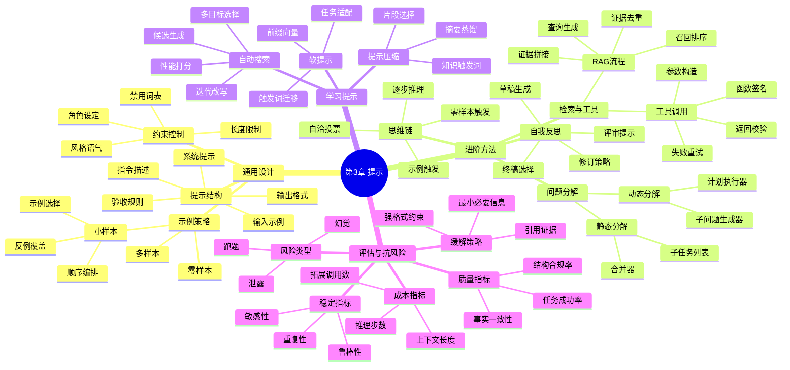

## **第 3 章 提示**

### **通用提示设计**

**解释：** 在大语言模型 (LLM) 中，“提示”通常指我们提供给模型的输入文本，也就是向模型提出的问题、指令或上下文 。可以把提示想象成对模型下指令的方式：就像我们向人提问或说明任务一样，对 LLM 也需要清晰地描述我们想要它做什么。提示可以很简单（例如一句话的指令），也可以很复杂（包含背景信息、角色设定和示例） 。为了编写提示，我们常使用**提示模板**，就好比预先写好一封信的格式，留出一些空白（占位符）等待填写具体内容 。例如，一个简单的提示模板可能是：“请给我一些有趣的周末建议。” 如果我们想让提示更具体，可以这样写模板：“如果{_前提_}，你有什么有趣的周末建议？”然后在使用时把“前提”换成实际情况，如“如果本周末天气很好” 。

提示设计强调**清晰和具体**。和日常生活一样，如果我们向朋友含糊地下指令，朋友可能无法给出满意答复；同理，LLM 需要明确的指示才能发挥更好效果。常见的提示策略包括：

- **说明角色和背景：** 我们可以在提示中指明模型的身份或上下文，例如：“你是一位经验丰富的医生，请用通俗易懂的语言解答以下健康问题。” 这类似于给模型一个“身份”，帮助它以特定视角回答 。
- **结构化格式：** 通过特定格式组织提示内容，例如使用问答格式（Q: 问题，A: 回答）或对话格式（角色名: 对话内容） 。比如，用“Q:”开头表示问题，“A:”开头让模型回答，可以暗示模型进行问答任务。
- **提供上下文和示例：** 对复杂任务，直接描述清楚背景和要求，比只给一句命令更可靠 。例如要模型做翻译，可以在提示里注明源语言、目标语言、风格要求等，然后再给出具体待翻译的句子，这样模型更明白任务要求 。

设计提示往往需要反复试验，也就是所谓的“提示工程”。**提示工程策略**通常是经验性的，没有放之四海皆准的公式 。例如，我们可能尝试不同措辞、不同顺序的信息，看看模型给出的回答哪种更符合预期。这有点像调味料配比：不断调整，直到找到“最佳配方”。因此，在实践中我们鼓励多尝试，多对比不同提示的效果。

**小结：** 提示是与 LLM 对话的入口，清晰明确的提示能得到更相关的回应。通过模板和结构化方法，可以有效地构建提示内容。提示工程需要试错和经验积累，但遵循“清晰、具体、提供必要上下文”的原则通常能提高模型输出质量 。

**实例：** 以 ChatGPT 为例，如果我们问它“给我周末有趣的活动建议”，这是一个简单直接的提示，ChatGPT 可能给出一些通用建议如“去郊游、看电影”等。而如果我们更具体地提示，例如：“你是一位精通本地活动的导游。这个周末天气晴朗，适合户外。请推荐 3 个适合家庭的有趣周末活动，并解释理由。” 这个详细的提示为模型提供了角色、背景和要求，ChatGPT 往往会给出更丰富且贴合需求的回答，比如推荐主题公园野餐、社区音乐会等，并说明每个活动的有趣之处。可见，清晰而有针对性的提示能引导模型输出更有用的结果。

**引导性问题：** 提示设计中，什么因素会影响 LLM 的回答质量？为什么提供示例或背景信息可以让模型表现更好？你能想到哪些日常类比来解释为什么提示要具体明确吗？

**可视化建议：** 可以绘制一张**“提示模板”流程图**，展示如何从模板到实际提示的填充过程。例如，用一个框图表示模板，里面标注占位符如何被具体内容替换，生成最终提示的过程。也可以做一个**对比图表**，左侧是笼统提示，右侧是改进后的具体提示，展示模型输出质量差异。

### **进阶提示方法**

**解释：** 当任务变得复杂，基本的提示可能不足以引导模型得出正确或详细的答案。这时，我们需要一些进阶的提示技巧，帮助模型进行**推理**和**分步思考**。以下是几种常用的进阶提示方法：

- **链式思维 (Chain-of-Thought, CoT)：** 这是一种鼓励模型**逐步推理**的提示策略。就像我们解数学题时会写下每一步计算过程，链式思维提示要求模型在给出最终答案前先列出中间的思考步骤 。通过显式要求模型“让我们一步步思考”，可以让模型将复杂问题拆解为一系列简单的步骤，从而提高准确性和逻辑性。例如，提问：“一个商人有 50 个苹果，卖出 20 个，又买进 30 个，现在有多少？” 若直接回答，模型可能立即给出结果。但如果提示加上“请分步给出推理过程”，模型会先算 50-20=30，再算 30+30=60，最后回答 60。这种逐步推理对于数学、逻辑推理等任务**非常有益** 。在 GPT 模型中，如果我们要求它“请先思考再回答”，它往往会先产出一段分析推理，再给出结论，使答案更可靠。
- **问题分解：** 当一个问题涉及多个子问题时，可以提示模型将**复杂问题拆解**。这有点像把一个大任务拆成几步完成。例如，用户提问：“比较一下爱因斯坦和牛顿谁对科学贡献更大，并解释原因。” 这是个综合问题。通过提示“请分步回答：1）各自主要贡献有哪些？2）比较贡献影响。”，模型会先分别列出爱因斯坦和牛顿的主要贡献，然后再进行比较。这种分解提示让模型逐一解决每个方面，再综合，避免遗漏或混乱。
- **自我优化 (Self-Reflection)：** LLM 如今具备一定的自我检查和改进能力，我们可以通过提示让模型**优化自己的输出**  。这类似于人写完文章后自己修改润色。具体做法是分两个阶段：先让模型给出初步回答，然后再提示模型审视这个回答并改进。例如，我们先让模型翻译一段文本，得到初译结果，再提示：“请检查以上翻译是否流畅准确，并在必要时修改。” 模型会对自己的翻译进行反馈调整，给出更好的版本  。这种方法利用模型的**指令遵循能力**来迭代提升答案质量，相当于模型自己充当了审稿人和修改者的角色。
- **集成 (Ensemble) 方法：** 不同的提示或不同的模型可能产生不同答案。集成方法就是**把多个输出结合起来**，取长补短  。一种做法是针对同一问题设计**多种提示**，让模型分别回答，再综合这些答案。例如，用三个不同措辞的提示让模型生成三个版本的摘要，之后我们可以从中投票选出最好的要点，或把它们合并成一个更全面的摘要  。另一种做法是让**多个模型**各自回答，然后采用多数投票或平均融合概率的方式决定最终答案  。研究表明，**多样化**的提示或模型输出能带来更稳健的结果，因为不同模型/提示可能覆盖不同方面，综合后能抵消单一输出的偏差  。一个典型例子是**自洽性 (self-consistency)** 技术：对同一道题，使用链式思维提示让模型**多次独立解题**，得到多个答案，然后选择出现次数最多的答案作为最终结果  。这种多数表决往往比只解一次更可靠。
- **RAG 与工具使用：** RAG 指**检索增强生成**(Retrieval-Augmented Generation)，简单说就是让模型在生成答案时**利用外部知识**。虽然 LLM 已经在训练中学到了大量知识，但难免有盲点或者知识过时。这时可以通过提示引导模型去使用一个检索工具（如搜索引擎）获取最新或具体的信息，然后再回答 。例如，对 ChatGPT 提示：“你可以通过搜索获取信息。用户问题：XX，请先检索相关内容再回答。” 这样模型会先去“查资料”，再给出根据资料的回答。类似地，还有让模型使用计算器、日历等工具，扩展模型能力的提示方法。ChatGPT 插件和有浏览功能的模型就是将这种理念付诸实践的例子。当模型能**调用工具**时，我们可以把复杂任务拆给模型：先让它决定用何种工具获取中间结果，再基于结果继续推理，从而解决原任务。这种提示策略将 LLM 的**语言能力**和外部**符号能力**结合起来，极大提高了解决问题的范围。

**小结：** 进阶提示方法通过**让模型显式“思考”或者借助额外信息**，能显著提升模型在复杂任务上的表现。链式思维和问题分解使模型一步步完成推理，自我优化利用模型本身进行结果改进，集成方法融合多种输出以提高可靠性，而 RAG 和工具使用则赋予模型查询外部知识和执行操作的能力。这些技巧在当前主流大模型（如 GPT 系列）的应用中已经展现出威力，例如 OpenAI 的 GPT-4 往往隐含地使用多步推理和工具调用来产生更精准的回答。

**实例：** 一个结合多种技巧的例子：我们让 ChatGPT 回答一个医学诊断问题。“病人出现发烧、咳嗽和胸痛，这可能是什么疾病？请说明推理过程。” ChatGPT 可能首先链式思维列出可能疾病（肺炎？肋膜炎？流感？），然后通过问题分解，考虑每种疾病的症状匹配，再综合给出最可能的诊断及理由。接着我们可以要求：“请检查上述诊断过程，是否有遗漏或者需要补充的信息？” 模型会自我优化，或许补充询问病人年龄、病史等。如果接入 RAG 工具，它甚至可以检索最新的医学指南来核对诊断依据。最后，我们让它列出两种不同提示下的诊断结果进行比较（集成思路）：比如一种提示强调症状，另一种提示强调体检和检验结果，各自给出结论，我们再让模型综合。这展示了链式思维、问题分解、自我优化、工具使用和集成**联合应用**的强大威力，ChatGPT 因此能给出近似专业医生的全面分析。

**引导性问题：** 为什么逐步思考能帮助模型得到更正确的答案？在什么情况下，我们需要让模型通过检索外部信息来帮助回答？如果你让模型回答同一个问题五次并得到不同答案，你会如何设计提示来选出最佳答案？

**可视化建议：** 绘制一个**“进阶提示方法思维导图”**，中心写上“复杂任务提示”，向外分支链出“链式思维”、“问题分解”、“自我优化”、“集成”、“RAG/工具”等节点，每个节点再连出简短说明。或者制作一张**流程示意图**：展示模型从接收提示，到执行检索/分步推理，再生成答案的多阶段流程，让学生直观理解这些提示技术如何作用于模型内部。

### **学习提示**

**解释：** 尽管人类可以手工设计提示，但有时候找到**最佳提示**并不容易，而且非常耗费精力。于是研究者想到，能不能让**机器来自动优化提示**？“学习提示”指的就是使用数据和算法来**自动发现或调整最有效的提示**。这里包含几个概念：提示优化、软提示，以及提示长度的缩减。

- **提示优化 (自动提示设计)：** 这是利用机器学习方法，从候选集中**搜索**出对特定任务效果最好的提示  。它可以被看作 AutoML（自动化机器学习）的一种应用，我们不再完全靠直觉猜测提示，而是定义一个搜索空间和评分标准，由算法来尝试各种提示方案。一个通用框架包括：1）**提示搜索空间**：比如限定提示的格式、可用词汇等；2）**性能评估**：衡量某个提示的好坏，如在验证集上模型回答的准确率或者得分  ；3）**搜索策略**：算法如何在海量可能的提示中寻找更优者（可以随机试，也可以模仿进化或利用 LLM 本身来生成变种提示）  。打个比方，这就像调教一只鹦鹉学舌：我们给它不同的短语，看哪个短语能让鹦鹉正确回应。提示优化的目标是尽可能**减少人工干预**，让模型自己找到最适合的“咒语”。现实中，有研究用 LLM 自己来提出候选提示、评估输出，再迭代改进提示，这种自举式方法节省人力又能获得新奇的提示想法  。
- **软提示：** 我们平常给模型的提示都是自然语言的文本，这是**硬提示**（人类可读的显式提示）。软提示则是一种**隐藏的、模型内部使用的提示表示** 。简单来说，软提示不以文字呈现，而是以一串可以学习的向量/embedding 存在于模型中  。可以把它想象成模型脑海里的“潜意识提示”：人类读不懂，但模型可以利用。为什么要有软提示？因为**硬提示可能很长很复杂**，每次都输入会降低效率 。而软提示可以被视为已经压缩到模型隐层的指令。“软提示”通常通过在训练过程中**学习一段额外参数**来实现，这段参数接在输入之前或之间，引导模型产生特定行为。举例来说，我们想让模型在回答时一直采用正式礼貌的语气。我们可以训练一个软提示向量，使模型接收它后输出风格变得正式。这比每次都在文本里加一句“请用正式语气回答”要高效。软提示的好处是：一旦学好，可以反复使用，且因为是内部向量，**计算成本低**，不会占用很长的上下文窗口  。当然，软提示对人来说不可读，也无法直接编辑，只能通过训练得到。但它为模型定制行为提供了另一种思路，相当于**在模型内隐藏了一个提示**。一些开源模型已支持软提示/提示调优（如 Prefix-Tuning 等），不用改模型参数，只训练一小段前缀向量，就能让模型执行新任务。
- **提示长度缩减：** 模型的输入窗口是有限的，过长的提示既增加计算量也可能导致相关信息被淹没。因此，有研究在探索**如何用更短的提示达成同样效果**  。一方面，可以通过**训练让模型“内化”提示**：例如，用微调让模型熟悉某种任务格式，以后只需很简短的指令就能触发复杂行为。这有点类似**知识蒸馏**：把长提示带来的知识融入模型参数，使模型对**精简指令**也能正确响应  。另一方面，可以使用算法自动**压缩提示**内容，例如用另一种表述方式或者删去冗余部分，同时保证模型表现不下降。例如，原本一句长指令“请将以下英文句子翻译成中文并保持正式语气”，可能通过训练让模型学会，只给关键词“翻译！”它也知道按要求翻译  。提示长度缩减的重要意义在于：当我们需要在同一提示中提供很多信息（比如多个示例、详细场景）时，能否找到更经济的表示方法，从而**节省上下文空间**。这包括使用更紧凑的格式、符号，甚至让模型自行概括提示。近期的方法如**上下文蒸馏**就是让强模型生成大量有上下文的问答对，用弱模型学会这些知识，以后弱模型回答类似问题就不需要完整的上下文了。

**小结：** 学习提示是为了让提示更高效、更智能。自动提示设计利用算法寻找最优提示，减轻人类反复调试的负担；软提示将提示搬进模型隐层，用 dense 向量替代长文本，实现了提示的信息压缩和快速调用 ；提示长度缩减则关注如何用**最少的字**达成**同样的意图**，避免冗长提示带来的开销。在实践中，这些方法让大模型的使用更加灵活：我们可以让模型**自己学会提示**（而不是我们教它），也可以通过**很短的触发词**唤起模型的大能力。

**实例：** 一个实际场景：某公司想用 LLM 批改英文作文并给分。他们发现直接提示“给这篇作文打分并反馈”效果一般，而且提示很长包含评分标准。后来他们采用提示优化算法，自动找到了一个奇怪但有效的短语作为指令，例如“GradeEssay101”。这个短语本身对人毫无意义，但模型经过训练知道看到它就要执行作文打分任务。于是每次他们只需在作文前加上“GradeEssay101”就能让模型进入评分模式——这就是软提示/提示学习的效果。在这个过程中，他们还让模型自己迭代改进提示措辞，最终提示被优化得非常简洁而有效。相比最初冗长的人工提示，他们现在的提示既短又准，模型响应也又快又好。

**引导性问题：** 你认为软提示的优势是什么，为什么不用普通语言也能指导模型？自动提示优化是否有可能找到人类意想不到但对模型有效的提示？在资源有限的情况下（比如提示长度受限），我们可以怎样确保模型依然获得完成任务所需的信息？

**可视化建议：** 绘制一个对比图：左边是传统提示流程（人类手工编写长提示，模型执行），右边是自动提示优化流程（模型/算法生成候选提示，不断缩短优化）。也可以用**示意图**展示软提示的概念：比如画一只“冰山”，露在水面上的是硬提示（人类可见文本），水面下更大的部分是软提示（模型内部向量），表明软提示在内部起作用但人看不见其具体内容。另外，用图表展示优化前后提示长度的对比，也是直观的可视化。

### **本章小结**

通过本章学习，我们了解到大语言模型的**提示技巧**对于引导模型行为至关重要。**基础提示**要求指令清晰具体，如同与模型沟通时的礼貌用语；**进阶提示**则利用了模型强大的潜力，包括让模型逐步推理、拆解复杂任务、自我评估改进，以及调用外部知识或多模型协作 。这些方法使 LLM 能够在不改变内部参数的情况下，充分发挥预训练所学知识来解决多样的问题。与此同时，研究者也在探索**自动化和优化提示**的途径，如自动搜索最佳提示、使用软提示嵌入信息以及压缩提示长度，从而减轻人工负担并提升交互效率。在实际应用中，提示设计已经演变成一门艺术和科学相结合的学问：既需要创意和试验，也开始借助算法和模型本身的力量来改进。对零基础的学习者来说，掌握提示工程的基本原则，并了解这些前沿方法，将为后续与大模型打交道打下坚实基础——无论是提问、调教模型，还是理解模型的回应，都将更加**游刃有余**。
