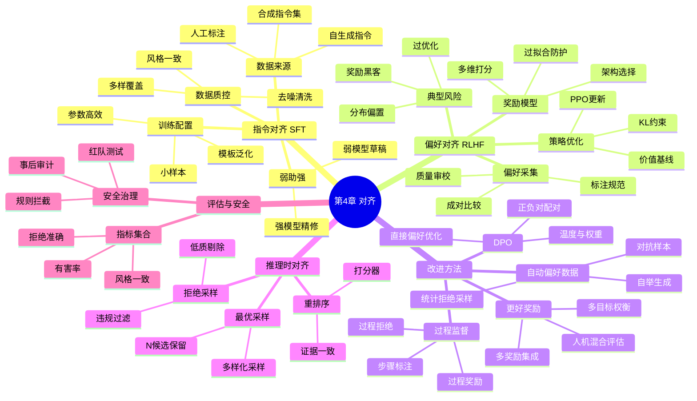

## **第 4 章 对齐**

### **LLM 对齐概述**

**解释：** “对齐”在大语言模型领域指的是**让模型的行为符合人类的期望、价值和指令**。简单地说，就是训练模型学会“听话”和“守规矩”。未对齐的模型（只是纯粹通过海量文本预训练）可能擅长生成内容，但不一定会按照用户的真实意图办事；更糟的是，它可能输出有害、不准确或不适当的内容。对齐过程就是要**矫正**这些偏差，让模型既**有用**又**无害**。想象训练一只小狗：预训练让它学会很多本领，但对齐就像教它遵守主人指令，不乱咬人、不乱叫，通过奖励和引导让它成为一只“好狗”。在 LLM 中，对齐特别关注两个方面：**遵循用户指令**（有问必答、按要求格式回答等），以及**符合人类价值观**（不要产生歧视言论、隐私信息，遇到危险请求要拒绝等）。

对齐的重要性可以通过 ChatGPT 的例子来说明。ChatGPT 之所以比早期的 GPT-3 更受欢迎，不仅因为模型更大更聪明，还因为 OpenAI 花了大量精力**对齐**模型，使其回答更加友好、有礼貌，并避免违规内容。一个**未对齐**的模型，用户问它“How to make a bomb?” 也许它真的会详细说明步骤，这是非常危险的行为。而**对齐后**的模型会礼貌地拒绝：“对不起，这个请求我无法帮助。” 同样地，用户如果提出模棱两可的问题，一个未对齐的模型可能给出误导信息，但对齐模型会反问澄清或标注不确定。这一切都是对齐训练让模型学会了**遵守人类偏好的规则**。

总的来说，LLM 对齐涵盖了各种让 AI 行为和人类期望保持一致的方法，包括提供**良性实例微调**和**基于人类反馈的惩罚和奖励**。随着模型能力增强，对齐变得更加重要：模型越强大，如果不对齐，产生有害后果的风险就越高。因此，对齐工作既是技术问题也是伦理问题，在 AI 安全中占据核心地位。

**小结：** 对齐就是让大模型“**知礼仪、懂规矩**”。它确保模型的强大生成能力被用在正确的地方，避免违反人类意愿或造成伤害。没有对齐，大模型可能答非所问甚至“惹是生非”；经过对齐，大模型才真正成为让人放心的智能助手。

**实例：** 早期的 GPT-3 模型有时会在回答中使用不礼貌或偏激的语言，因为互联网训练语料中混杂了大量这类信息。而 ChatGPT 通过对齐训练学会了**礼貌用语和中立表述**。比如，当用户用粗话辱骂时，未对齐模型可能直接回骂或者生成更多攻击性语言，但经过对齐的 ChatGPT 会回应类似：“我理解你的情绪，但是我们可以冷静地讨论问题。” 又如，在医疗咨询场景下，未对齐模型可能胡乱给出诊疗建议甚至引用不存在的药物（毕竟模型不懂医疗伦理）；而一个对齐模型会更加谨慎，提供可靠信息并在不确定时建议“咨询专业医生”。这些例子表明，对齐让模型更贴近**一个负责、理性的助手**的形象。

**引导性问题：** 你认为为什么一个性能很强的语言模型仍然需要专门的对齐？模型不对齐可能带来哪些风险和后果？在日常生活中，让 AI 系统符合人类价值观，你觉得困难在哪里？

### **指令对齐**

**解释：** 指令对齐主要讨论如何通过**监督微调**让模型学会更好地**遵循人类指令**。预训练的 LLM 虽然积累了海量知识，但它并不知道如何按照人的要求行事，比如接到一条明确指令时该如何回应。**指令微调**（Instruction Tuning）就是使用一系列“**人类提供的指令-响应示例**”来训练模型，使其在看到类似指令时，能够给出正确、有用的回答 。它相当于教模型学做人类的听话助手。

指令对齐的一般过程：首先，我们需要**收集微调数据**。也就是一批**指令**以及**对应的理想回应**。这些可以是让人类专家写的问题和答案对，或者从现有问答社区中整理，甚至可以让一个强模型生成指令和回答（自造数据）。然后，对 LLM 进行**有监督微调 (SFT)**，本质是一个有监督学习：输入是指令，输出让模型去拟合期望的答案 。经过这样的训练，模型就会把“看到指令->按照示例风格回答”内化为自己的能力。

在指令对齐中，有几个关键点：

- **监督微调 (SFT)：** 直接用人类标注的正确输出来细调模型。例如，让模型学习当指令是“翻译以下句子”时，输出正确的翻译；当指令是“写一封道歉信”时，输出得体的信件等等。这一步几乎就是手把手教模型做题。
- **微调数据获取：** 数据从哪里来？可以**人工标注**，也可以**模型生成**。人工标注质量高但量少费时，所以业界常先用强模型产生大量初始指令回答对，再由人过滤修改作为训练集（比如 Self-Instruct 的方法）。还有项目开源人类写的问题答案集合（如 Databricks 的指令数据集）。质量好的数据对最后效果很重要  。
- **使用更少数据微调：** 有趣的是，研究发现即使只有几百条高质量指令示例，也能显著提升模型指令服从性。这说明模型已具备理解指令的大致能力，一点点**触发**即可激活。在资源有限情况下，人们探索**小数据微调**甚至**单次学习**的方法，让模型尽快学会指令跟随。
- **指令泛化：** 我们希望模型不只会按训练过的指令套路回答，还能触类旁通，遇到新形式的指令也能处理。这需要训练数据的多样性覆盖尽可能广，另外模型参数足够灵活泛化。举例来说，模型看过很多问句-答句，就能明白任何问句都该老老实实回答，而不是发散闲聊。
- **使用弱模型改进强模型：** 有一种有趣的思路是，拿一个**较弱的模型**（但已经对齐好的）去帮助训练**更强但未对齐**的模型。这听起来反直觉，然而研究表明在某些 NLP 任务上，小模型的指导也能提升大模型的表现  。例如，让 GPT-2 这样的模型先对一批指令生成回答，再用这些回答去微调 GPT-4 模型  。本质上，大模型在学习小模型的输出，这有点像**知识蒸馏**从弱到强的逆向应用  。虽然强模型可能学到弱模型的错误，但实验发现这种弱指导有时能改善强模型对某些任务的泛化  。这方向还在探索，但它预示未来可能需要用 AI 来监督比 AI 本身更强的 AI。

**小结：** 指令对齐通过**有监督学习**方式，让模型掌握按照人类**指令办事**的能力。核心在于准备大量高质量的指令/响应数据来微调模型 。结果是模型对用户要求更敏感、回答更准确。这是 ChatGPT 等模型成功的第一步：他们用了成千上万的问答对来教模型如何扮演各种助理角色。从获取数据、到小数据也出效果、到用已有模型协助生成数据，指令对齐方法在不断发展，使对齐过程更高效。**一句话**：指令对齐让模型从“知道很多”变成“按你说的做”。

**实例：** OpenAI 在训练 InstructGPT（ChatGPT 的前身）时，收集了用户可能提出的各种指令（比如“解释…是什么”、“给…提建议”、“翻译…这句话”等）以及理想的回答。这些回答有的由人类写，有的由模型草拟再人工润色。经过监督微调后，模型表现出了惊人的指令遵循能力。举例：原先 base GPT-3 如果你问：“请给我早餐食谱”，它可能胡乱输出一段和早餐无关的文本，因为它没学过遵循请求。而微调后的模型会老老实实列出早餐食谱步骤。这期间甚至发现，只用很少的示例微调（如 100 条），模型的变化就很明显：它开始更直接地回答问题而非发散，学会用礼貌开头，结构也更清晰。这展示了指令微调的威力。另外，一些开源尝试（如 Stanford Alpaca 项目）用弱模型(比如文本-davinci-003)生成了 5 万条指令数据来微调一个 7B 的小模型，结果小模型也学会了很多 ChatGPT 的本领。这等于用强模型产出的“经验”灌输给了小模型，实现了以小搏大。

**引导性问题：** 如果让你来给模型准备指令对齐的数据，你会优先选择哪些类型的问答？模型学会遵循指令后，是否意味着它总是正确的？当指令和道德规范冲突时（比如非法指令），模型该如何抉择，这属于对齐的哪个方面？

### **人类偏好对齐：RLHF**

**解释：** RLHF 是“从人类反馈中进行强化学习”的缩写（Reinforcement Learning from Human Feedback） 。这是当前对齐大模型的关键方法之一，用来进一步**调整模型的输出使其符合人类偏好**。直观理解，RLHF 就像训练模型参加一个“好回答”比赛：当模型输出令评审（人类）满意的回答时，就给它奖励；不满意的就惩罚（或不给奖励）。模型在这个反复试错中学会了迎合人类的口味。

RLHF 通常分三步：

1. **收集偏好数据：** 让人类来选择模型输出中的较好者。例如，我们给模型同一个问题生成两份回答，送给人类评审，人类选出更优的那个。这构成了一条**人类偏好数据**（回答 A 优于回答 B）。
2. **训练奖励模型 (RM)：** 用上一步大量的人类偏好数据，训练一个“奖励模型” 。这个模型输入一段问答，就输出一个分数，表示回答好坏程度。它等于是学会模拟大多数人类评审的喜好，对输出进行打分 。比如，奖励模型会给礼貌详尽的回答高分，给含糊或有害的回答低分。
3. **强化学习微调：** 最后，使用**强化学习算法**（常用 PPO 算法）来更新原 LLM 的参数 。具体做法是：让 LLM 产生回答，根据奖励模型打分作为“奖励”，强化学习调整 LLM 使其倾向产生**高分回答**，避开低分回答。这个过程反复进行，相当于**模型和奖励模型玩游戏**：模型尝试不同回答风格，奖励模型打分反馈，模型调整策略以赢得高分 。

经过 RLHF，模型会明显更符合人类喜好。例如更乐于遵循指令、语气更友善、内容更有用，还学会适当地拒绝不合理要求。在 ChatGPT 案例中，OpenAI 正是通过人类反馈（大量用户在早期对话中点哪个回复好）训练了奖励模型，然后用 PPO 调教模型，从而大幅提升了回答质量和安全性。

需要注意的是，RLHF 并不直接告诉模型**什么是对的**，而是通过人类偏好间接塑造模型行为。这可能引入一些问题：如果人类反馈有偏差，模型就学到偏差偏好；奖励模型不完美，可能被模型“投机取巧”利用（称为奖励黑客）。因此设计好偏好数据和奖励模型尤为重要 。

**小结：** RLHF 是一种**让模型迎合人类**的强化学习方法。它通过人类在环路中给反馈，让模型逐渐纠正自己输出，达到让人满意的状态 。这是 ChatGPT 等成功应用背后的秘诀之一。RLHF 体现了 AI 对齐的思想：不用明确编写规则，而是让模型从人类偏好中“体会”到什么是好的回答，就像孩子通过奖惩明白哪些行为受欢迎。结果是模型变得更懂我们的需求和雷区，回答既有帮助又守规。

**实例：** 假设我们让一个未经过 RLHF 的模型和一个经过 RLHF 的模型回答同样的问题：“能讲一个关于友谊的短故事吗？” 未对齐模型可能给出一个平淡甚至略负面的故事。而 RLHF 模型倾向于给出积极温馨、有道德寓意的故事，因为在人类偏好数据中，这样的故事更可能被评为“好”。又比如，用户问：“我很难过，应该怎么办？” 未对齐模型也许随便安慰两句甚至无视用户情绪开始闲聊。但 RLHF 模型会变得**富有同理心**，可能回答：“很抱歉听到你难过。你可以尝试向朋友倾诉，或者做些让自己放松的事情……如果情况严重，寻求专业帮助也很重要。” 这种贴心和慎重就是从人类反馈中学来的。当初人类评审看到模型这样回应，会给高分；模型为了得到高分，就学习这种风格。还可以举一个安全性的例子：用户请求不当内容，一个未对齐模型可能直接给出，而 RLHF 模型大概率回复拒绝语：“抱歉，我无法帮助执行这个请求。”——因为在训练中，这样的拒绝被人类标注为正确行为，模型因此学会了**拒绝技巧**。

**引导性问题：** 你觉得奖励模型在这个过程中扮演了什么角色？如果人类反馈本身存在争议（比如不同人偏好不同），模型该如何对齐？有没有可能模型学着学着，找到“套路”骗过奖励模型却没真正理解人类意图（所谓奖励黑客）？

### **改进的人类偏好对齐**

**解释：** RLHF 已经相当有效，但也存在挑战和局限，于是许多改进方法被提出，以进一步完善对齐效果或降低成本。本节介绍几种改进思路：

- **更好的奖励建模：** 奖励模型在 RLHF 中至关重要，它的好坏直接影响最终模型的行为。如果奖励模型不精确，可能引导 LLM 走偏。因此改进奖励模型是一个方向  。改进措施包括：增加奖励模型的训练数据量和多样性，让它对各种输出判分更可靠；引入人类多维度反馈，而非简单好坏，例如引入对事实准确性、礼貌程度等的多指标评价；或者采用**集成多个奖励模型**，综合它们的判断，减小单一模型偏差。还有研究探索更复杂的奖励函数，而不仅仅由比较偏好训练。总之，更好的奖励模型能让 LLM 在强化学习时有更正确的“努力方向”。
- **直接偏好优化 (DPO)：** 这是近来提出的一种替代 RLHF 的技术，试图**跳过复杂的强化学习算法**，直接用偏好数据来微调模型。设想我们已经有人类偏好比较数据（A 回答优于 B 回答）。DPO 的方法是不训练奖励模型和用 PPO，而是直接构造一个损失函数，使模型对**人类偏好的回答**概率更高，对不受偏好的降低。这有点类似有监督地“尽量生成被偏好的答案”。其优点是流程简单、稳定性好，不需要反复试采样调整，相当于**一步到位融入偏好**。一些实验显示，在某些任务上 DPO 能达到和 PPO 相当的效果，但实现更简单。这代表着研究者在寻找更**高效稳健**的对齐训练方式，避免强化学习难调参数的问题。
- **自动生成偏好数据：** 人类反馈数据宝贵但获取困难，所以一个改进方向是**用 AI 辅助生成更多偏好数据**。例如，可以用一个已初步对齐的模型产生大量问题和多种回答，再用另一个模型或规则去判断哪个更好，从而得到伪偏好标签。这有点像用弱模型给强模型做教练，也类似前述弱带强的思路。OpenAI 据称在训练 GPT-4 时，也用模型自我对话产生了很多额外的训练数据。Anthropic 的研究也尝试让 AI 自己提出对抗性问题检验自己。有了这些**人工+模型**混合的偏好数据，能扩大覆盖场景，减少对真人评估的依赖。当然，为确保可靠，还常结合少量人类验证。总体来说，这种方法试图**降低对大量人工标注的需求**，用机器生成/评估来加快偏好数据积累。
- **逐步对齐 (过程监督)：** 传统 RLHF 只关注最终输出对不对，但对于需要复杂推理的问题，仅看最终答案对错可能不够  。逐步对齐的想法是在**模型推理的中间步骤**也给予监督和反馈  。打个比方，如果模型在解一道数学题，中间算错了但最后猜对了答案，按结果来看是正确的，但过程有误。这会误导强化学习认为整条解答路径都 OK。过程监督会针对**每一步**判断正误。例如收集带有详细解题步骤的数据，人工标注每步是否正确  。然后训练一个“步骤级别”的奖励模型，奖励模型不再只看最终答案，而是看整条推理链的正确率。这能引导模型既关注答案对，也关注**过程正确**。其效果是模型学习更严谨地推理，不会仅为了正确答案忽略逻辑错误。虽然获取逐步标注很费力，但在高要求领域（数学证明、代码推理）非常有价值。这个方法体现了 **“授之以渔”** 的理念：让模型真正理解解决问题的过程，而不只是投机取巧。
- **推理时对齐 (Inference-time alignment)：** 上述方法都需要改模型参数（微调），而推理时对齐尝试**在不改模型的情况下提高输出对齐度**  。一种简单方式叫**N 选 1 (Best-of-N)**：让模型针对同一请求一次生成 N 个不同候选输出，然后用奖励模型（或规则）从中选出最符合人类偏好的那个作为最终答复  。这样模型本身没变，但我们**筛选**了输出。相当于一次考试出了 N 个作文，我们选最好的一篇。实践证明，如果 N 选得足够多，往往能挑到一个不错的答复质量接近甚至超过原 PPO 微调的模型  。推理时对齐还有扩展，比如**拒绝采样微调**：用 Best-of-N 选出的好答案再来微调模型，代替 RLHF 的 PPO。Facebook 的 LLaMA2 就是用了多轮这种拒绝采样，从而在不大量人类标注的情况下做出了高质量对齐模型  。推理时对齐的思路使得对齐可以**作为后处理**来做，不需要复杂的在线训练。它也揭示了一个有趣现象：当前 LLM 生成的 N 个候选中，往往潜藏着比默认输出更好的答案。通过重排序或筛选，我们能“挖掘”出模型潜在的最佳表现  。这说明模型本身能力够强，只是搜索过程未必总找到最佳答案。

**小结：** 改进的人类偏好对齐方法丰富多彩：有人专注于提升**评价器**（奖励模型）的质量，有人简化流程直接优化**偏好目标**，有人用**AI 自助**来获取额外偏好数据，还有人在**更精细的维度上监督模型**，以及利用**推理阶段技巧**提升输出品质。这些探索解决了 RLHF 的一些痛点，如不稳定、昂贵或可能出现的不良策略 。最终目标都是一致的：让对齐更高效，让模型更可靠安全。未来对齐技术可能是多种手段结合，例如先用大量人工和模型生成数据做指令微调+DPO，然后用少量高质量人类反馈做 RLHF 调整，再加上推理时筛选把关。这将使模型既训练得好，又运行时保险，为用户提供**最佳体验**且风险可控的 AI 助手。

**实例：** 假如我们有一款对话模型，已经做了基本 RLHF。但我们发现它有时候虽然回答对了，语气却略显啰嗦，或者推理过程不严谨。为改进：

- 我们可以让另一批人专门给一些回答的“礼貌度”和“简洁度”打分，训练一个更精细的奖励模型，让模型学会优化这些方面（更好的奖励建模）。
- 或者，我们手头偏好数据有限，就不做 PPO 了，而是直接用人类偏好对比来调模型参数（直接偏好优化）。结果发现模型一样变得更听话了，而训练过程更简单稳定。
- 另外，我们让模型自己生成一组关于礼貌用语的对话，然后自己评价哪段对话语气更友好，以此增加训练数据（自动生成偏好数据）。模型开始学会更自然地道歉和感谢，不那么生硬了。
- 针对逻辑推理问题，我们收集了一些带标注步骤的数学题解答，让模型学会每一步都检查。之后模型在数学问答中不仅答案正确，过程也清晰严谨（逐步对齐效果）。
- 最终部署时，我们采用 N 选 1 策略：让模型对用户每个请求生成 3 个不同措辞的回答，用一个轻量级过滤模型挑掉含有不当内容的，剩下再选一个最合适的呈现（推理时对齐）。用户几乎从不会看到模型的不当回答了，因为已经被拦下。

这些改进组合起来，使模型从“基本对齐”升级为“精益对齐”——回答既正确又优雅，过程有据可循，安全边界也更牢靠。

**引导性问题：** 你认为有没有完全不需要人参与的对齐方法？如果奖励模型判断错了，会对训练造成什么影响？让模型在每一步推理都接受监督，会不会降低它探索创新解答的能力？

**可视化建议：** 绘制一个**对齐技术进化树**或流程图：展示从基础 RLHF 延伸出的不同改进分支，如 DPO（标注为“免 RL 强化”）、自动数据（标注“自举数据”）、过程监督（标注“步骤反馈”）、推理重排序（标注“N 选 1”）等，让读者一目了然不同方法的关系。也可以制作简化的**比较表**列出：RLHF vs DPO vs 拒绝采样 等，在数据需求、训练复杂度、效果等方面的对比，让学习者总结这些方法优缺点。

### **本章小结**

本章我们探讨了**对齐大型语言模型**的一系列技术。从指令微调到人类反馈强化学习，再到各种新颖的改进方法，它们共同构成了让 AI 行为符合人类期望的工具箱 。我们了解到，指令对齐为模型奠定了听从指挥的基础，而 RLHF 进一步雕琢模型的性格，使之既懂我们的意思又不会逾矩伤害 。在 RLHF 的基础上，研究者不停优化——更准确的奖励、更直接的训练、自动化的数据、细粒度的监督、推理阶段的调整——这些努力旨在**降低对齐的成本与风险**，提升模型的安全性和可靠性。==**AI 对齐**始终面临一个核心挑战：如何确保人工智能的目标真的是我们想要的目标，并且它不会用我们不希望的方式实现目标 。==为此，我们需要在技术上精益求精，在伦理上未雨绸缪。随着模型越来越强大，对齐的重要性愈发凸显：正是有了对齐技术，强大的 LLM 才能成为人类的助手而非失控的机器。对初学者来说，这章内容传递的理念是：**能力越大，责任越大**——训练 AI 不仅要教会它技能，更要教会它做“正确”的事。未来，对齐将继续作为 AI 发展的关键主题，陪伴 AI 一路成长为更安全、更可靠的系统。

