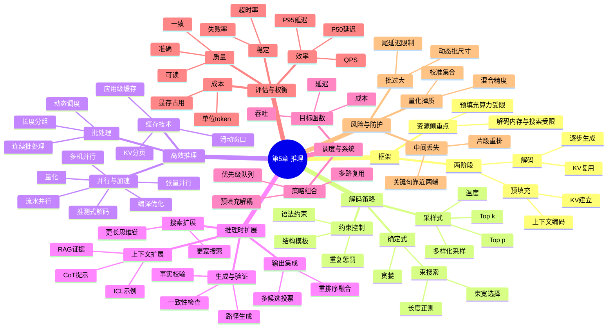

## **第 5 章 推理**

### **预填充与解码**

**解释：** 大语言模型的**推理**，指的是它生成文本答案的过程。在技术上通常把这个过程划分为两个阶段：**预填充 (Prefill)** 和**解码 (Decode)** 。打个比方，我们可以把 LLM 想象成一个接龙写故事的人：

- 在预填充阶段，模型先**读完输入**（比如你问的问题或给的前文），就像人在正式回答前先把题目或已有内容看懂。这一步模型会把输入通过其 Transformer 层编码，存储成一种内部状态，类似于我们把题目记在脑子里 。技术上，这常通过**KV 缓存**实现：模型对输入序列做一次前向计算，把产生的键值对缓存下来 。这样做的好处是，在后续生成时不用每次都重新处理整个输入，节省了大量计算 。
- 在解码阶段，模型开始**一个字（token）接一个字地生成**输出 。它会利用预填充阶段存下的“记忆”（KV 缓存）和已经生成的部分，不断预测下一个可能的词。这个过程是自回归的：每产生一个词，就把它也加入上下文，然后预测下一个，直到遇到终止条件（比如生成了句号或特殊结束符）。解码的目标是在庞大的可能续写中找到一条高概率且合适的序列 。可以说，预填充相当于“大脑蓄力”，解码则是“大显身手”。

**解码算法**决定了模型究竟如何选择每一步的输出 。常见的几种策略：

- **贪婪搜索 (Greedy)：** 每一步都选取概率最高的下一个词 。这种方法最快也最确定，生成的文本往往**最平淡常见**（因为模型老选最可能的词）。类比来说，这是最保守的策略，好比每次考试都写老师最想看到的标准答案。但它的缺点是如果某一步有局部最优，会错失全局更优解，可能导致内容**缺乏创意**或重复。此外，一旦某步选错，后面无法反悔纠正。
- **束搜索 (Beam Search)：** 同时保留多个候选输出序列，在每一步扩展这些候选，再只保留前 k 个最有希望的，直到完成  。这有点像走迷宫时一箭多雕，平行探索几条路线，希望至少一条能走到宝藏。束搜索在翻译等任务中常用，输出质量往往比贪婪高一些。然而对于非常开放的生成任务（如写故事），束搜索倾向于收敛在相似的高概率套路上，依然**缺乏多样性**。而且 k 太大会消耗计算，k 太小则作用有限，所以要权衡效率和效果 。
- **随机采样 (Sampling)：** 给输出引入随机性，而不是总选最优。具体实现有**Top-k 采样**和**Top-p 采样**等  。Top-k 采样是每步从概率前 k 的词中随机选一个，Top-p（又称**核采样**）是从累积概率达到 p（如 0.9）的词集合里选  。这样可以保证不选那些罕见得离谱的词，又保留一定**惊喜**。比如让模型写诗歌或讲笑话，引入随机能产生更多样化、有创造性的结果。同时我们可以调节**温度 (temperature)** 参数控制随机程度：温度高，则概率分布变平，更随机；温度低，模型输出更确定趋于贪婪  。简单说，温度=0 等同贪婪，温度很高相当于每次基本骰子决定下个词。因此采样法能让生成既连贯又有变化，但过高的随机性可能使输出语无伦次，需要把握平衡。

此外还有**重复惩罚**、**禁止词约束**等技巧，可在解码时扣掉模型生成重复短语或不良词汇的概率，保证输出既不啰嗦也不触雷 。例如，给定 Penalty 函数专门打压那些违背安全规范的输出，模型在解码中会主动避开不当内容 。

总结一下，解码阶段其实是在做一个搜索问题：模型预测下一个词的概率分布，但要在指数级的可能序列空间里找一条**既合理又满足需要**的路径。不同算法就是不同的“寻路策略”。**没有一种算法适用于所有场景**：生成新闻概要可能需要稳健（低温度或束搜索），而写小说则需要丰富（高温度采样）。好的应用会根据任务选择或混合使用这些策略，让 LLM 发挥最佳水平。

**小结：** 预填充-解码框架让我们理解了 LLM 生成文字的内在流程：先读懂输入再逐步写出回答 。在解码过程中，不同策略影响了**创造性 vs 准确性**的平衡。贪婪搜索快但保守，束搜索更全面探索，随机采样赋予创造力，温度和 Top-k/p 提供调节旋钮。通过调整解码算法，我们可以让同一个模型既能严谨答题，也能妙笔生花。推理阶段还可以引入额外约束，以确保输出不违背设定的要求（比如避免不良词汇）。对于学习者而言，掌握这些解码策略，就好比掌握了**调控 AI 说话风格的遥控器**，能更好地驱动模型输出符合期望的内容。

**实例：** 让我们用一个句子预测的例子来直观感受不同解码策略。假设输入是“机器学习使生活…”。如果用贪婪搜索，模型可能接着输出“更美好”，因为这是最高频的延续，最终句子可能是“机器学习使生活更美好。” 用束搜索(k=3)也许也会得出类似的，因为“更方便”“更智能”这些都有较高概率，束搜索会比较这些完整句子的总概率，可能仍然选“更美好”。如果用 Top-p 采样(p=0.9)，模型也许会尝试一些不一样的词，比如“更有趣”或“更加便利”，有一定随机性但不会太离谱。如果把温度调高，模型甚至可能说出“机器学习使生活变成一场游戏”，更具有奇思妙想的色彩。这展示了**同一个模型**在不同解码策略下风格迥异：严格策略下措辞安全中规中矩，随机策略下可能产生让人耳目一新的句子。当然，过高随机度下，它可能胡说“机器学习使生活充满樱桃味”，这就偏离常理了。这就是为什么我们需要平衡，让模型输出**既合理又不千篇一律**。

**引导性问题：** 你觉得在哪些应用场景下需要引入随机性增强创造力，哪些场景下则必须用确定性方法？如果模型每次都选最高概率词，会发生什么问题（比如重复或卡住在某个循环）？当我们设置一个很低的温度时，模型输出和高温度相比有何明显区别，为什么？

**可视化建议：** 可以设计一个**解码树形图**：起始节点是模型读入的 Prompt，然后分叉代表每一步可能的下一个词，树上标注不同搜索策略如何遍历这棵树（如贪婪是一条直线走，束搜索是几条平行前进，随机采样是在高概率子树里随机跳）。也可以做一个**小实验图表**：用相同开头让模型在不同温度下生成句子，把结果并排展示。例如温度 0、0.7、1.2 下模型生成三句话的对比，用颜色标出不同行为（重复/新颖），帮助理解温度影响。

### **高效推理技术**

**解释：** 当我们把 LLM 用于真实应用时，响应速度和资源占用是非常关键的。高效推理技术关注如何**让模型尽快给出答案、用更少的内存和计算** 。考虑这样一个比喻：如果 LLM 回答问题是一家披萨店做披萨，高效推理就是想办法提升出餐速度、减少浪费。以下是主要的高效推理策略：

- **更多缓存 (KV Cache)：** 前面提到过，Transformer 模型在生成时会不断用到之前的计算结果。**键-值缓存**技术就是在第一次计算时把每一层的中间表示存下来，后续生成新词时重复利用  。现实意义是，例如在对话中，你问了长长一段话，模型回答第一句时已经处理过这段话；当模型回答第二句时，不需要再把你的长问题过一遍，而是用上次缓存，加快运算。另一个缓存思路是在**应用级别**做缓存：把用户常问的问题及对应答案存在数据库里，下次遇到同样请求直接返回已有答案 。这就好像披萨店把热门披萨先做好一批，顾客一来立刻取出。不用每次都现做，自然更快。需要注意缓存的命中率：只有用户请求重复或相似时缓存才发挥作用 。但在实际系统，比如客服问答里，常见问题缓存可以极大减少模型调用次数，提升效率。
- **批处理 (Batching)：** 现代硬件（尤其 GPU）擅长同时处理并行任务。批处理就是把**多个输入一起交给模型**，利用并行计算提升吞吐量 。这有点像披萨店同时烤多张披萨，每张披萨的等待时间并不会线性增加。对于 LLM，如果有 10 个请求，每个单独处理可能要 10 秒总计；但批处理一起处理，可能仍然接近 10 秒就都完成了，而不是 100 秒。批处理的难点在于对齐不同长度的输入/输出：通常需要用填充（padding）使它们并行计算齐头并进。尽管每个请求的**延迟**可能略有上升（因为要等一批凑满或最长的那个完成），但总体**吞吐**高了许多。因此对于同时大量请求的场景（比如 API 服务高峰），批处理能显著降低单位请求的计算成本。开发者经常要在批大小和延迟之间做权衡，找到性价比最佳点。
- **并行化 (Parallelism)：** 当模型本身很大，单块 GPU 放不下或者算不动时，就需要把模型计算**分拆到多块设备**并行完成 。并行化有多种：**模型并行**将模型不同层分给不同 GPU，流水线式计算；**张量并行**把每层内部的矩阵拆分到多 GPU 计算再合并；还有**专家模型并行**等等。简单打个比方，如果模型是一本 1000 页的书，一台机器读可能很慢，那让 10 台机器各读 100 页，最后把结果汇总，就快很多。并行化需要解决设备间通信和同步问题，好比多人协作时要互相传递结果，可能会有一些额外开销  。但对于超大模型，这是唯一可行的方法。例如 GPT-3 175B 参数，需要多个 GPU 共同存储计算，否则单 GPU 内存根本装不下全部参数。并行化也可以用于**多节点多机**，构成分布式推理。总之，通过横向扩展硬件，让多份资源共同完成任务，可以线性缩短推理时间（理想情况下），使大模型的响应不至于慢得无法使用。
- **量化和剪枝：** 另一类高效技术是减少计算本身的工作量，比如把模型参数从 32 位精度降到 8 位（量化），或者剪掉一些影响小的神经元连接。量化就好比用简略版菜谱做披萨，可能味道几乎一样，但步骤更简洁省料。实践中，量化可以极大降低模型内存占用和计算量（因为低精度乘法更快），代价是可能损失一点点精度。不过对 LLM 来说，经过精心校准的量化（如 4-bit 量化）往往几乎不损伤模型效果，却能把运行成本降很多。目前许多开源模型通过量化在消费级 GPU 上实现了较快推理。模型剪枝则是删除不重要的权重或神经元，让模型“瘦身”，加速推理。这在学术上有研究，但在 LLM 上大规模剪枝可能影响性能，因此更常用的是量化。
- **其它加速策略：** 例如**编译优化**（用专门的深度学习编译器或 GPU kernel 提升计算效率）、**异步并行**（生成过程中一边计算下一步一边传输之前结果）、**流水线推理**（不同层同时处理不同 token，如生产线一样）。还有利用**硬件加速器**（如 TPU、ASIC）专门针对 Transformer 结构优化。这些都属于工程层面的改进，把模型的推理速度尽可能榨干硬件能力。对使用者而言不需要深入了解原理，只需知道通过软硬件优化，可以显著缩短模型响应时间、降低每次调用成本。

**小结：** 高效推理技术是保证 LLM 应用**实用化**的关键。缓存让重复计算最小化（就像不重做已经做过的功课） ；批处理和并行化充分利用硬件并行能力，“人多力量大”加快处理；量化剪枝让模型精简，跑得更快更省；各种优化手段则从编译和硬件层面挖潜。这些技术相辅相成，我们经常会组合使用。例如，在一个实际对话系统中：对用户历史对话做缓存、多个用户问题批处理、模型用 8-bit 量化版本部署在多 GPU 上，并针对 GPU 做过推理代码优化——最终实现**毫秒级**响应。对于学习者，这部分内容显示出：**算法高效性和工程优化**对 AI 产品的重要性，不仅要模型聪明，也要跑得快。

**实例：** 想象我们部署一个在线聊天室 AI，同时有 100 个用户提问。如果每个问题独立处理，可能一条回答要 1 秒，那 100 人同时就可能等上接近 1 分钟才能都回复。而如果我们使用批处理，例如一次让模型处理 10 个问题，模型在大约 1.5 秒内就能给出 10 个回答，那么 100 个问题分 10 批不到 15 秒就全部回答完毕了。这对单个用户来说，每个人平均等待也就几秒，大大提升了体验。再比如，一个用户的问题很长，有一大段背景介绍，每次问后续问题都重复那段背景。如果没有缓存，每次模型都要重新读那段背景花费大量计算。有了缓存，模型记住了背景的计算结果，后续回答时直接接着算新内容，速度快了很多。这类似我们看侦探小说，记住了之前章节内容，后面推理时不用每次从头再读。同样，如果模型部署时用了 4-bit 量化，本来需要 16GB 显存的模型现在 8GB 就够了，我们可以用较便宜的硬件服务更多用户且速度更快。这些例子都说明，高效推理技术让强大的模型真正**用得起、用得快**。

**引导性问题：** 你能想到生活中哪些场景相当于缓存和批处理吗？为什么量化模型能加速却不明显降低效果，这背后可能是什么原理？在保证输出一致的前提下，我们有没有可能让模型“跳过”某些计算来更快给结果（提示：思考人类快读和略读的方法）？

**可视化建议：** 制作一个**“提速技巧”集合图**：画出几个象征性的图标，如时钟表示缓存（节省时间）、并行计算机表示批处理/并行、剪刀表示剪枝减小模型、降阶梯表示量化降低位宽等等，每个图标旁用一句话点明作用。也可以做一个**折线图**或柱状图，横轴不同优化开启组合，纵轴响应时间，直观展示优化叠加如何将推理时间从比如 5 秒降到 1 秒。对于缓存，可画两张对比：第一张无缓存，模型每次处理整段文本；第二张有缓存，模型只处理增量部分，用颜色高亮重复部分被跳过的情形。

### **推理时扩展**

**解释：** “推理时扩展”指的是在模型**生成推理阶段**投入更多计算资源或策略，以**进一步提高模型性能** 。换句话说，当我们**不增加训练**也不改模型参数的情况下，通过巧妙地利用推理步骤，来解决更复杂的问题。这有点像在考试中不会的题时，允许考生多拿几张草稿纸、多找一些线索，尽可能把答案找对。推理时扩展的方法可以从多个角度展开，主要包括：

- ==**上下文扩展：** 在推理时给模型**提供更多有帮助的上下文信息**  。==比如之前提过的 Few-shot 例子，在提示里加入示例，相当于扩展了输入内容。再如**思维链提示**和**问题分解**，也是通过上下文中显式列出推理步骤或子问题，让模型更容易得出正确答案  。另外还有**动态检索**：如 RAG，在推理时根据当前问题检索文档，把相关资料拼到提示里  。上下文扩展的核心是在不改变模型的情况下，**最大化利用上下文窗口**提供的容量，用示例、提示技巧或外部知识填满它。其收益是显而易见的：模型可以借助这些信息完成原本单靠内部知识难以完成的任务。不过受限于上下文长度，过多信息模型未必消化得完，而且上下文窗口有限，不可能无限塞入信息 。因此上下文扩展需要选择**最相关**的信息提供，这本身也是一门学问（比如检索要精准，示例要有代表性)。
- ==**搜索扩展：** 把**解码的搜索空间和深度加大**，用更强力的搜索找到更好的输出  。通俗地讲，就是允许模型**尝试更多种可能答案**再选择最佳。==最简单的例子是增大 beam width（束宽），我们之前说过 k 太大消耗高，但如果容许推理时花更多时间，可以把 k 设大一些以免错失好的解答  。另一种是**延长输出长度**：比如对于需要详细推理的题目，鼓励模型生成更长的推理链。研究发现，让模型在数学题上输出更长的思路往往结果更好，因为**详尽思考**有助于正确 。甚至有论文提出让模型在脑海里构建**树形或图形的推理结构**，同时探索多条路径再选优  （类似蒙特卡罗树搜索在决策中的用法）。当然，搜索扩展会显著增加计算量，是跟效率相博弈的——要收获质量就得多算。实践中，我们常在**关键要求高准确**的任务上使用一些搜索扩展，比如关乎安全性或正确率时，让模型多试几遍不同措辞回答，然后选择最好的一个输出用户。这可看作 N-best re-ranking，与前一章推理时对齐的 Best-of-N 思想吻合  。
- **输出集成：** 这个概念和前面提示部分的集成类似，但在推理时侧重于**合并多个输出以提高鲁棒性**  。假设我们可以让模型针对同一问题独立生成 5 个答案，那么集成方法可以是投票选最常见答案，或者逐字比较融合，甚至训练一个小模型来挑或合成答案  。输出集成的直观好处是：万一某个单次输出有瑕疵，不会直接呈现给用户，我们可以综合信息后得到**更稳健**的结果  。例如，当问题很难时，不同次生成的答案可能各说一部分对，通过集成我们也许能拼出一个完整正确的答案。这个过程需要额外计算资源，因为要生成和处理多个输出，但换来的是**降低单次出错率**。OpenAI 据传在 GPT-4 开发中尝试过类似方法，让多个 GPT-4 实例互相讨论或投票，以减少错误。这种“群体智慧”思路在 LLM 推理阶段也是有效的。
- **生成和验证思维路径：** 这是一种更高级的推理扩展技巧，尤其针对复杂问题（如数学、多步骤推理）  。它超越了简单的链式思维，而是让模型**生成多个可能的思考路径**，并对其进行验证，最终选出正确路径得出答案  。可以理解为模型带有“怀疑”和“检查”能力的推理。例如在解一道难题时，模型先想出一个方案 A 和方案 B，然后模型自己或另一个验证模型检查这两个方案哪个结果正确，淘汰错误的，再深入方案正确的继续推理。这类似人类解决难题时会：尝试不同解法->验证其中一些是否走得通->弃掉行不通的。实现上，可以让模型在每一步生成后调用另一个过程来审核这一步是否合理（比如计算检验中间结果正确性），或者在最后让模型基于自己的多条推理链做**一致性判断**，选择大多数链指向的答案（self-consistency，就是前述自洽方法的泛化）  。这种生成+验证的方法显著提高了解复杂推理问题的准确率，因为它**减少了模型走错路不知返**的情况。Google 的“Tree of Thoughts”以及 DeepMind 的“理由者模型”等都是这类思想的体现：用更多计算和自我检验，换来复杂问题上**更可信的解答**。

**小结：** 推理时扩展充分利用了模型在推理阶段的**灵活性**：我们可以给它更多信息（上下文扩展），让它尝试更多方案（搜索扩展），综合多种结果（输出集成），以及自行检查纠错（生成-验证） 。这些方法都不需要改模型参数或重新训练，却往往能显著提升性能，是近年来应对 LLM 复杂任务的**利器** 。当然，这些扩展通常以增加计算为代价，所以实际使用时会考虑场景的重要程度和资源情况。如果是在关键任务（如医学诊断）或模型推理还不够可靠的情况，我们宁可多花几倍算力采用推理扩展以确保正确；但在实时聊天等场景，速度体验重要，就可能少用。总之，推理时扩展为 LLM 提供了**额外的“大脑助推”**：无需更聪明的模型，也能通过“深思熟虑”获得更聪明的结果。

**实例：** 一个具体场景：我们让 ChatGPT 解一题数学竞赛题。如果直接回答，ChatGPT 可能尝试一遍链式思维，给出一个答案，但不保证正确。现在应用推理时扩展：

- **上下文扩展：** 在提示里加入相关数学定理或例题作为参考，让模型有更多背景知识。ChatGPT 会先参考这些已知定理，思路更清晰。
- **搜索扩展：** 让 ChatGPT 想出**两个不同的解法**：代数法和几何法，各自推理。如果第一次推理没成功，第二种可能成功，提高找到正确解的机会。
- **输出集成：** 得到两个解答后，我们让模型对比哪种更简洁正确，或者直接把两种解答的共同结论作为最终答案（如果它们一致，那可信度很高，如果不一致，可以提示模型再检查）。
- **生成+验证：** 甚至我们可以让 ChatGPT 在给出答案前，再自己验证一下结果是否符合题意。如果发现矛盾，再返回重新推理。例如算出答案后，把它代回原问题条件检验，ChatGPT 发现不符合就会警觉并修正。

经过这些扩展，ChatGPT 解这道竞赛题的正确率比单次回答**大大提高**，过程也更令人信服。虽然它为此做了比平常回答多几倍的计算，但对于攻克高难度问题来说是值得的。这个例子体现了在推理阶段给予模型“二次机会”“多角度思考”和“自检纠错”的威力。

**引导性问题：** 你觉得为什么不在训练时就解决这些问题，而选择推理时扩展？上下文提供太多信息可能有什么负面效果？模型自我验证的可靠性如何，能完全相信它自己的判定吗？推理时扩展的方法会不会也有极限（比如模型遇到超出它能力范围的题目）？

**可视化建议：** 制作一个**推理扩展流程图**，以解决一个复杂问题为例，从普通单线推理对比到多分支推理：画出模型尝试方案 A、B、C，然后筛选出正确路径的过程。可以用决策树形式，标注在某步验证失败，于是剪去该分支的情形，最后剩下一条正确分支通向答案。此外，可以准备一张**对比图表**：列出某难题下，不用扩展 vs 用各类扩展后的模型成功率，用柱状图表示提升幅度，以量化展示推理扩展的效果。

### **本章小结**

在本章中，我们讨论了大型语言模型（LLMs）的**推理问题** 。我们介绍了**预填充-解码**框架及相关的**解码算法**，了解如何通过不同策略控制模型生成文本的方式和风格 。接着，我们描述了多种**高效推理**的技术，从缓存、批处理到并行化、量化，让模型在实际应用中运行得更快、更省资源。我们还讨论了**推理时的扩展**方法——这被认为是提升 LLM 推理能力的重要手段之一 。通过在推理阶段投入更多计算和策略，如提供更多上下文、扩大搜索、集成输出、验证推理路径，我们可以在不改动模型本身的情况下显著增强其解题能力和可靠性。

综合而言，推理阶段既涉及**工程优化**，也包含**算法创新**。对于入门学习者，现在可以明白：让大模型给出一个好答案，不仅仅是模型本身够强，还需要我们巧妙地“驾驭”它——既包括用好的**提示**引导（上一章内容），也包括选对**生成策略**、配置好**运行环境**、在必要时让模型“多想一会儿”再答。这些技巧结合起来，才能让大型语言模型真正发挥出最佳表现，为用户提供**又快又好的回答**体验。
