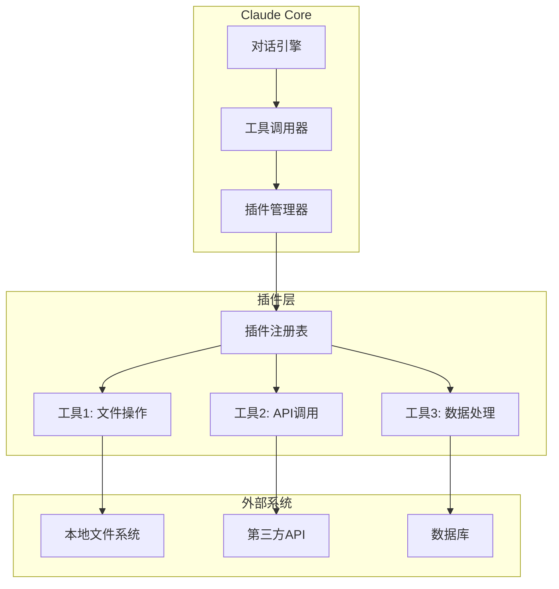

# Claude 插件开发完全指南

## 🚨 立即开始 (现象层)

### 什么是Claude插件？

Claude插件是扩展Claude能力的工具集合，让AI能够：

- 🔗 **连接外部系统** - 访问数据库、API、文件系统
- 🤖 **自动化工作流** - 执行复杂的多步骤任务
- 🎯 **专业领域增强** - 添加特定行业或技术栈的专业能力

### 快速开始：第一个插件

```json
// manifest.json - 插件清单文件
{
  "name": "my-first-plugin",
  "version": "1.0.0",
  "description": "我的第一个Claude插件",
  "tools": [
    {
      "name": "hello_world",
      "description": "向世界问好",
      "input_schema": {
        "type": "object",
        "properties": {
          "name": {
            "type": "string",
            "description": "要问候的名字"
          }
        },
        "required": ["name"]
      }
    }
  ]
}
```

```python
# plugin.py - 插件实现
import json

def hello_world(name: str) -> str:
    """向指定的人问好"""
    return f"Hello, {name}! 欢迎来到Claude插件的世界！"

# 插件函数映射
FUNCTIONS = {
    "hello_world": hello_world
}

def execute_function(function_name: str, parameters: dict) -> str:
    """执行插件函数"""
    if function_name in FUNCTIONS:
        return FUNCTIONS[function_name](**parameters)
    else:
        return f"未找到函数: {function_name}"
```

## 🔬 深度架构分析 (本质层)

### Claude插件的系统架构



### 关键设计模式

#### 1. 工具抽象模式

```python
from abc import ABC, abstractmethod
from typing import Dict, Any

class ClaudeTool(ABC):
    """Claude工具基类"""
    
    @abstractmethod
    def get_schema(self) -> Dict[str, Any]:
        """返回工具的JSON Schema"""
        pass
    
    @abstractmethod
    def execute(self, **kwargs) -> Any:
        """执行工具功能"""
        pass
    
    @property
    @abstractmethod
    def name(self) -> str:
        """工具名称"""
        pass
    
    @property
    @abstractmethod
    def description(self) -> str:
        """工具描述"""
        pass

# 实现具体工具
class FileReaderTool(ClaudeTool):
    @property
    def name(self) -> str:
        return "read_file"
    
    @property
    def description(self) -> str:
        return "读取本地文件内容"
    
    def get_schema(self) -> Dict[str, Any]:
        return {
            "type": "object",
            "properties": {
                "file_path": {
                    "type": "string",
                    "description": "要读取的文件路径"
                },
                "encoding": {
                    "type": "string",
                    "default": "utf-8",
                    "description": "文件编码格式"
                }
            },
            "required": ["file_path"]
        }
    
    def execute(self, file_path: str, encoding: str = "utf-8") -> str:
        try:
            with open(file_path, 'r', encoding=encoding) as f:
                return f.read()
        except Exception as e:
            return f"读取文件失败: {str(e)}"
```

#### 2. 插件注册模式

```python
class PluginRegistry:
    """插件注册管理器"""
    
    def __init__(self):
        self._tools: Dict[str, ClaudeTool] = {}
    
    def register_tool(self, tool: ClaudeTool):
        """注册工具"""
        self._tools[tool.name] = tool
    
    def get_tool(self, name: str) -> ClaudeTool:
        """获取工具"""
        return self._tools.get(name)
    
    def list_tools(self) -> Dict[str, Dict[str, Any]]:
        """列出所有工具及其Schema"""
        return {
            name: {
                "description": tool.description,
                "schema": tool.get_schema()
            }
            for name, tool in self._tools.items()
        }
    
    def execute_tool(self, name: str, **kwargs) -> Any:
        """执行工具"""
        tool = self.get_tool(name)
        if not tool:
            raise ValueError(f"工具 '{name}' 未找到")
        
        return tool.execute(**kwargs)

# 全局注册表
registry = PluginRegistry()
```

#### 3. 错误处理与安全模式

```python
import functools
import logging
from typing import Any, Callable

def safe_execution(func: Callable) -> Callable:
    """安全执行装饰器"""
    @functools.wraps(func)
    def wrapper(*args, **kwargs):
        try:
            # 参数验证
            validate_parameters(func, kwargs)
            
            # 权限检查
            check_permissions(func.__name__)
            
            # 执行函数
            result = func(*args, **kwargs)
            
            # 结果验证
            validate_result(result)
            
            return result
            
        except PermissionError as e:
            logging.error(f"权限错误: {e}")
            return {"error": "权限不足", "details": str(e)}
            
        except ValidationError as e:
            logging.error(f"参数验证失败: {e}")
            return {"error": "参数无效", "details": str(e)}
            
        except Exception as e:
            logging.error(f"执行错误: {e}")
            return {"error": "执行失败", "details": str(e)}
    
    return wrapper

def validate_parameters(func: Callable, params: dict):
    """验证函数参数"""
    # 实现参数类型和范围验证
    pass

def check_permissions(tool_name: str):
    """检查工具执行权限"""
    # 实现权限验证逻辑
    pass

def validate_result(result: Any):
    """验证执行结果"""
    # 实现结果验证逻辑
    pass
```

## 💡 插件设计哲学 (哲学层)

### 设计原则

#### 1. "最小权限原则" - 安全第一
```python
# ❌ 坏的设计 - 过度权限
class FileManager:
    def __init__(self):
        self.root_access = True  # 危险！
    
    def delete_anything(self, path):
        os.remove(path)  # 没有限制！

# ✅ 好的设计 - 最小权限
class SafeFileManager:
    def __init__(self, allowed_dirs: List[str]):
        self.allowed_dirs = [os.path.abspath(d) for d in allowed_dirs]
    
    def delete_file(self, path: str):
        abs_path = os.path.abspath(path)
        
        # 检查路径是否在允许范围内
        if not any(abs_path.startswith(allowed) for allowed in self.allowed_dirs):
            raise PermissionError(f"访问路径 {path} 被拒绝")
        
        os.remove(abs_path)
```

#### 2. "单一职责原则" - 工具专一化
```python
# ❌ 坏的设计 - 功能混杂
class SwissArmyKnife:
    def do_everything(self, action, data, format, output, ...):
        if action == "read":
            # 读文件逻辑
        elif action == "write":
            # 写文件逻辑
        elif action == "calculate":
            # 计算逻辑
        # ... 100行后

# ✅ 好的设计 - 职责明确
class FileReader(ClaudeTool):
    name = "read_file"
    description = "专门读取文件"
    
    def execute(self, file_path: str) -> str:
        return self._read_file_safely(file_path)

class Calculator(ClaudeTool):
    name = "calculate"
    description = "专门进行数学计算"
    
    def execute(self, expression: str) -> float:
        return self._evaluate_safely(expression)
```

#### 3. "幂等性原则" - 可重复执行
```python
# ✅ 幂等操作
class IdempotentFileCreator(ClaudeTool):
    def execute(self, file_path: str, content: str):
        # 检查文件是否已存在且内容相同
        if os.path.exists(file_path):
            with open(file_path, 'r') as f:
                if f.read() == content:
                    return f"文件 {file_path} 已存在且内容相同"
        
        # 创建或更新文件
        with open(file_path, 'w') as f:
            f.write(content)
        
        return f"文件 {file_path} 创建成功"
```

#### 4. "优雅降级原则" - 失败友好
```python
class RobustAPIClient(ClaudeTool):
    def execute(self, url: str, timeout: int = 30):
        try:
            # 尝试主要服务
            response = requests.get(url, timeout=timeout)
            return response.json()
            
        except requests.Timeout:
            # 降级：返回缓存数据
            cached_data = self.get_cached_data(url)
            if cached_data:
                return {
                    "data": cached_data,
                    "source": "cache",
                    "warning": "主服务超时，返回缓存数据"
                }
            
            # 最后降级：返回默认数据
            return {
                "data": self.get_default_data(),
                "source": "default",
                "warning": "服务不可用，返回默认数据"
            }
        
        except Exception as e:
            # 记录错误但不崩溃
            logging.error(f"API调用失败: {e}")
            return {
                "error": "服务暂时不可用",
                "suggestion": "请稍后重试"
            }
```

### 哲学思考：插件即生态

> "一个优秀的插件不是为了展示技术，而是为了解决真实的问题。它应该像呼吸一样自然，用户感受到的是能力的延展，而不是复杂性的增加。"

```python
# 插件设计的哲学体现
class PhilosophicalPlugin:
    """
    插件设计哲学：
    1. 简单性 - 接口直观，使用简单
    2. 可组合性 - 可与其他工具协作
    3. 可扩展性 - 易于添加新功能
    4. 可靠性 - 优雅处理各种情况
    """
    
    def __init__(self):
        self.principles = {
            "简单性": "复杂的内部，简单的接口",
            "可组合性": "插件间无缝协作",
            "可扩展性": "未来需求的友好支持",
            "可靠性": "用户信赖的稳定表现"
        }
```

## 🛠 实战开发指南

### 高级插件示例：智能代码分析器

```python
import ast
import os
from typing import Dict, List, Any

class CodeAnalyzer(ClaudeTool):
    """智能代码分析插件"""
    
    @property
    def name(self) -> str:
        return "analyze_code"
    
    @property
    def description(self) -> str:
        return "分析Python代码结构、复杂度和潜在问题"
    
    def get_schema(self) -> Dict[str, Any]:
        return {
            "type": "object",
            "properties": {
                "code_path": {
                    "type": "string",
                    "description": "代码文件或目录路径"
                },
                "analysis_type": {
                    "type": "string",
                    "enum": ["structure", "complexity", "quality", "all"],
                    "default": "all",
                    "description": "分析类型"
                }
            },
            "required": ["code_path"]
        }
    
    @safe_execution
    def execute(self, code_path: str, analysis_type: str = "all") -> Dict[str, Any]:
        """执行代码分析"""
        
        if os.path.isfile(code_path):
            files = [code_path]
        elif os.path.isdir(code_path):
            files = self._find_python_files(code_path)
        else:
            raise ValueError(f"路径不存在: {code_path}")
        
        results = {}
        
        for file_path in files:
            with open(file_path, 'r', encoding='utf-8') as f:
                code = f.read()
            
            # 解析AST
            tree = ast.parse(code)
            
            file_analysis = {}
            
            if analysis_type in ["structure", "all"]:
                file_analysis["structure"] = self._analyze_structure(tree)
            
            if analysis_type in ["complexity", "all"]:
                file_analysis["complexity"] = self._analyze_complexity(tree)
            
            if analysis_type in ["quality", "all"]:
                file_analysis["quality"] = self._analyze_quality(tree, code)
            
            results[file_path] = file_analysis
        
        return {
            "analysis_summary": self._generate_summary(results),
            "detailed_results": results,
            "recommendations": self._generate_recommendations(results)
        }
    
    def _analyze_structure(self, tree: ast.AST) -> Dict[str, Any]:
        """分析代码结构"""
        visitor = StructureVisitor()
        visitor.visit(tree)
        
        return {
            "classes": len(visitor.classes),
            "functions": len(visitor.functions),
            "lines_of_code": visitor.lines,
            "imports": len(visitor.imports),
            "class_details": visitor.classes,
            "function_details": visitor.functions
        }
    
    def _analyze_complexity(self, tree: ast.AST) -> Dict[str, Any]:
        """分析复杂度"""
        visitor = ComplexityVisitor()
        visitor.visit(tree)
        
        return {
            "cyclomatic_complexity": visitor.complexity,
            "max_nesting_depth": visitor.max_depth,
            "complex_functions": [
                f for f in visitor.function_complexities 
                if f["complexity"] > 10
            ]
        }
    
    def _analyze_quality(self, tree: ast.AST, code: str) -> Dict[str, Any]:
        """分析代码质量"""
        issues = []
        
        # 检查命名规范
        visitor = NamingVisitor()
        visitor.visit(tree)
        issues.extend(visitor.issues)
        
        # 检查代码风格
        style_issues = self._check_style(code)
        issues.extend(style_issues)
        
        # 检查潜在问题
        safety_issues = self._check_safety(tree)
        issues.extend(safety_issues)
        
        return {
            "total_issues": len(issues),
            "issues_by_type": self._group_issues_by_type(issues),
            "detailed_issues": issues,
            "quality_score": self._calculate_quality_score(issues)
        }

# AST访问器类
class StructureVisitor(ast.NodeVisitor):
    def __init__(self):
        self.classes = []
        self.functions = []
        self.imports = []
        self.lines = 0
    
    def visit_ClassDef(self, node):
        self.classes.append({
            "name": node.name,
            "line": node.lineno,
            "methods": len([n for n in node.body if isinstance(n, ast.FunctionDef)]),
            "docstring": ast.get_docstring(node)
        })
        self.generic_visit(node)
    
    def visit_FunctionDef(self, node):
        self.functions.append({
            "name": node.name,
            "line": node.lineno,
            "args_count": len(node.args.args),
            "docstring": ast.get_docstring(node),
            "is_async": isinstance(node, ast.AsyncFunctionDef)
        })
        self.generic_visit(node)

# 注册插件
registry.register_tool(CodeAnalyzer())
```

### 插件生态系统集成

```python
class PluginEcosystem:
    """插件生态系统管理器"""
    
    def __init__(self):
        self.registry = PluginRegistry()
        self.workflow_engine = WorkflowEngine()
        self.config_manager = ConfigManager()
    
    def create_workflow(self, name: str, steps: List[Dict]):
        """创建工作流"""
        workflow = Workflow(name, steps)
        
        # 验证工作流中的工具是否都可用
        for step in steps:
            tool_name = step.get("tool")
            if not self.registry.get_tool(tool_name):
                raise ValueError(f"工具 '{tool_name}' 不可用")
        
        self.workflow_engine.register_workflow(workflow)
        return workflow
    
    def execute_workflow(self, workflow_name: str, input_data: Dict) -> Dict:
        """执行工作流"""
        workflow = self.workflow_engine.get_workflow(workflow_name)
        
        context = {"input": input_data, "results": {}}
        
        for step in workflow.steps:
            tool_name = step["tool"]
            params = self._prepare_params(step["params"], context)
            
            result = self.registry.execute_tool(tool_name, **params)
            context["results"][step.get("output_key", tool_name)] = result
        
        return context["results"]

# 示例工作流：代码审查流程
code_review_workflow = {
    "name": "code_review",
    "description": "自动代码审查流程",
    "steps": [
        {
            "tool": "read_file",
            "params": {"file_path": "{{input.file_path}}"},
            "output_key": "code_content"
        },
        {
            "tool": "analyze_code",
            "params": {
                "code_path": "{{input.file_path}}",
                "analysis_type": "all"
            },
            "output_key": "analysis_result"
        },
        {
            "tool": "generate_report",
            "params": {
                "analysis": "{{results.analysis_result}}",
                "template": "code_review_report"
            },
            "output_key": "review_report"
        }
    ]
}

ecosystem = PluginEcosystem()
ecosystem.create_workflow(**code_review_workflow)
```

## 📚 最佳实践与学习路径

### 开发最佳实践

#### 1. 测试驱动开发
```python
import unittest
from unittest.mock import patch, mock_open

class TestFileReaderTool(unittest.TestCase):
    def setUp(self):
        self.tool = FileReaderTool()
    
    def test_read_existing_file(self):
        """测试读取存在的文件"""
        with patch("builtins.open", mock_open(read_data="test content")):
            result = self.tool.execute("test.txt")
            self.assertEqual(result, "test content")
    
    def test_read_nonexistent_file(self):
        """测试读取不存在的文件"""
        with patch("builtins.open", side_effect=FileNotFoundError()):
            result = self.tool.execute("nonexistent.txt")
            self.assertIn("读取文件失败", result)
    
    def test_schema_validation(self):
        """测试Schema验证"""
        schema = self.tool.get_schema()
        self.assertIn("file_path", schema["properties"])
        self.assertIn("file_path", schema["required"])

# 运行测试
if __name__ == "__main__":
    unittest.main()
```

#### 2. 配置管理
```python
# config.yaml
plugins:
  file_operations:
    enabled: true
    max_file_size: 10MB
    allowed_extensions: [".txt", ".py", ".json", ".md"]
    forbidden_paths: ["/system", "/etc"]
  
  api_client:
    enabled: true
    timeout: 30
    retry_attempts: 3
    rate_limit: 100  # requests per minute

# 配置加载器
import yaml
from typing import Dict, Any

class PluginConfig:
    def __init__(self, config_path: str = "config.yaml"):
        with open(config_path, 'r') as f:
            self._config = yaml.safe_load(f)
    
    def get_plugin_config(self, plugin_name: str) -> Dict[str, Any]:
        return self._config.get("plugins", {}).get(plugin_name, {})
    
    def is_plugin_enabled(self, plugin_name: str) -> bool:
        return self.get_plugin_config(plugin_name).get("enabled", False)

# 在插件中使用配置
class ConfigurableFileReader(FileReaderTool):
    def __init__(self, config: PluginConfig):
        self.config = config.get_plugin_config("file_operations")
        self.max_size = self._parse_size(self.config.get("max_file_size", "1MB"))
        self.allowed_extensions = self.config.get("allowed_extensions", [])
    
    def execute(self, file_path: str, encoding: str = "utf-8") -> str:
        # 检查文件扩展名
        if self.allowed_extensions:
            ext = os.path.splitext(file_path)[1]
            if ext not in self.allowed_extensions:
                return f"不支持的文件类型: {ext}"
        
        # 检查文件大小
        if os.path.getsize(file_path) > self.max_size:
            return f"文件过大，超过限制: {self.max_size} bytes"
        
        return super().execute(file_path, encoding)
```

#### 3. 监控与日志
```python
import logging
import time
import functools
from typing import Dict, Any

# 配置日志
logging.basicConfig(
    level=logging.INFO,
    format='%(asctime)s - %(name)s - %(levelname)s - %(message)s',
    handlers=[
        logging.FileHandler('plugin.log'),
        logging.StreamHandler()
    ]
)

def monitor_execution(func):
    """执行监控装饰器"""
    @functools.wraps(func)
    def wrapper(*args, **kwargs):
        start_time = time.time()
        tool_name = getattr(args[0], 'name', 'unknown_tool')
        
        logger = logging.getLogger(f'plugin.{tool_name}')
        logger.info(f"开始执行: {kwargs}")
        
        try:
            result = func(*args, **kwargs)
            execution_time = time.time() - start_time
            
            logger.info(f"执行成功，耗时: {execution_time:.3f}s")
            
            # 记录执行指标
            PluginMetrics.record_execution(
                tool_name=tool_name,
                success=True,
                execution_time=execution_time,
                parameters=kwargs
            )
            
            return result
            
        except Exception as e:
            execution_time = time.time() - start_time
            logger.error(f"执行失败: {e}, 耗时: {execution_time:.3f}s")
            
            # 记录失败指标
            PluginMetrics.record_execution(
                tool_name=tool_name,
                success=False,
                execution_time=execution_time,
                error=str(e),
                parameters=kwargs
            )
            
            raise
    
    return wrapper

class PluginMetrics:
    """插件执行指标收集"""
    
    _metrics: Dict[str, Dict[str, Any]] = {}
    
    @classmethod
    def record_execution(cls, tool_name: str, success: bool, 
                        execution_time: float, **kwargs):
        """记录执行指标"""
        if tool_name not in cls._metrics:
            cls._metrics[tool_name] = {
                "total_calls": 0,
                "successful_calls": 0,
                "failed_calls": 0,
                "total_time": 0.0,
                "avg_time": 0.0,
                "last_error": None
            }
        
        metrics = cls._metrics[tool_name]
        metrics["total_calls"] += 1
        metrics["total_time"] += execution_time
        metrics["avg_time"] = metrics["total_time"] / metrics["total_calls"]
        
        if success:
            metrics["successful_calls"] += 1
        else:
            metrics["failed_calls"] += 1
            metrics["last_error"] = kwargs.get("error")
    
    @classmethod
    def get_metrics(cls, tool_name: str = None) -> Dict[str, Any]:
        """获取指标数据"""
        if tool_name:
            return cls._metrics.get(tool_name, {})
        return cls._metrics
    
    @classmethod
    def generate_report(cls) -> str:
        """生成指标报告"""
        report = ["=== Claude 插件执行报告 ===\n"]
        
        for tool_name, metrics in cls._metrics.items():
            success_rate = (metrics["successful_calls"] / metrics["total_calls"] * 100 
                          if metrics["total_calls"] > 0 else 0)
            
            report.append(f"工具: {tool_name}")
            report.append(f"  总调用次数: {metrics['total_calls']}")
            report.append(f"  成功率: {success_rate:.1f}%")
            report.append(f"  平均执行时间: {metrics['avg_time']:.3f}s")
            if metrics["last_error"]:
                report.append(f"  最近错误: {metrics['last_error']}")
            report.append("")
        
        return "\n".join(report)

# 使用监控装饰器
class MonitoredFileReader(FileReaderTool):
    @monitor_execution
    def execute(self, file_path: str, encoding: str = "utf-8") -> str:
        return super().execute(file_path, encoding)
```

### 学习路径规划

#### 初级阶段 (1-2周)
1. **理解Claude插件机制**
   - 学习JSON Schema定义
   - 掌握工具函数编写
   - 实践简单的文件操作插件

2. **基础开发技能**
   - Python基础语法回顾
   - 异常处理最佳实践
   - 单元测试编写

#### 中级阶段 (2-4周)
1. **架构设计**
   - 学习设计模式在插件中的应用
   - 掌握插件注册和管理机制
   - 理解安全性和权限控制

2. **高级功能**
   - API集成和网络请求
   - 数据库操作插件
   - 异步操作处理

#### 高级阶段 (1-2月)
1. **生态系统开发**
   - 工作流引擎设计
   - 插件间通信机制
   - 分布式插件架构

2. **性能优化**
   - 并发处理优化
   - 缓存策略实施
   - 监控和诊断系统

#### 专家阶段 (持续学习)
1. **创新应用**
   - AI/ML集成插件
   - 领域特定插件开发
   - 插件生态系统贡献

2. **社区建设**
   - 开源插件项目
   - 最佳实践分享
   - 新手指导和培训

---

## 📊 总结与展望

Claude插件开发不仅仅是技术实现，更是一种思维方式的转变：

- **从功能实现到能力扩展** - 不是简单的功能堆叠，而是能力的有机延伸
- **从单一工具到生态系统** - 构建可组合、可协作的工具集合
- **从解决问题到预防问题** - 通过优秀的设计避免常见陷阱

> "优秀的插件如同优秀的诗歌，不在于华丽的辞藻，而在于恰到好处的表达。每一个函数都应该有其存在的理由，每一个参数都应该承载明确的语义。"

记住Linus的智慧："简洁是复杂性的终极表现形式"。在插件开发的道路上，始终追求简洁、优雅、可靠的解决方案。

**下一步行动:**
1. 选择一个实际问题开始你的第一个插件
2. 加入Claude插件开发者社区
3. 持续学习和分享经验
4. 为生态系统贡献你的力量

让我们一起构建一个强大而优雅的Claude插件生态系统！ 🚀